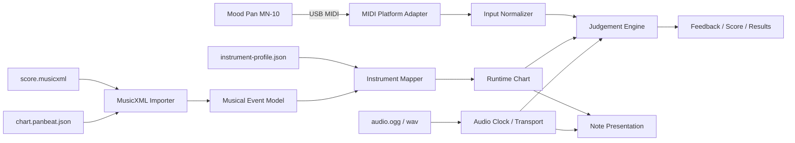
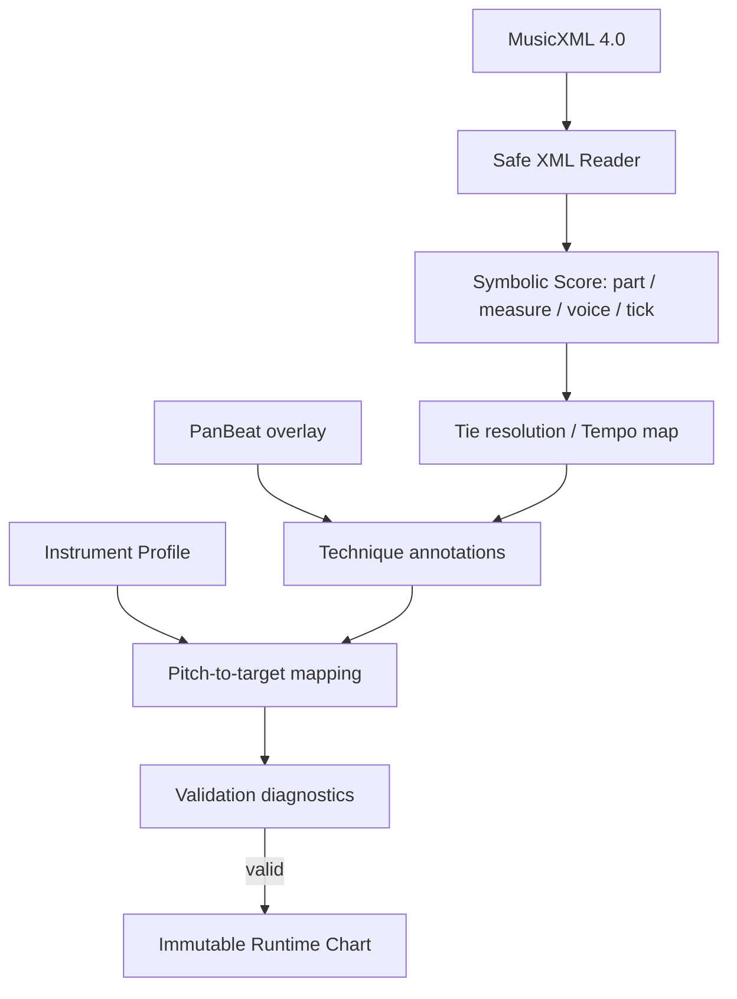

# PanBeat 技術選定・アーキテクチャ設計書

## 1. 文書情報

| 項目 | 内容 |
|---|---|
| 対象 | PanBeat MVP およびその後の拡張 |
| 入力要件 | `docs/requirement.md` |
| 想定プラットフォーム | Phase 0と初期MVPはmacOSのみ。Windows / ブラウザは将来候補 |
| 技術選定状況 | Godot 4.6.stable.official.89cea1439 + typed GDScriptを採用（ADR-001 Accepted） |
| 設計方針 | オーディオクロック基準、エンジン非依存ドメイン、デバイス依存部の分離、データ駆動 |
| 調査日 | 2026-08-08 |

---

## 2. 結論

PanBeat の初期MVPは **Godot 4.6 + typed GDScriptによるmacOS向けデスクトップアプリ**として開発する。Phase 0ではUnity 6 LTSとGodot 4.6を同一のMood Pan実機・譜面・音源・計測条件で比較し、Godotが全hard gateを通過してweighted score 75.00となったため採用した。Unityは参考score 61.00だが入力dispatch jitterが`Not Measured`で、採用対象外とした。Windowsは実機環境を確保した後の移植対象とし、初期MVP完成条件には含めない。

PanBeat は一般的なデスクトップ業務アプリではなく、次の性質を持つためである。

- 音声再生を基準に、MIDI入力を数十ミリ秒単位で判定する
- フレームレートから独立した時間軸でノーツを動かす
- 多数のリング、Ripple、Glowを安定して描画する
- ゲーム中の割り当てを避け、フレーム落ちによる体感品質低下を防ぐ
- 初期対象のmacOSで安定し、将来Windowsへ移植可能な境界を保つ
- 将来、練習モードや演出を大きく拡張する可能性がある

選定したGodotは標準MIDI入力、テキストscene、headless CLI、Web export、MIT Licenseに強みがある。Phase 1のMood Pan製品buildは実機3/3 sessionを完走し、Tone / Ding / Slap、+30 ms Input Offset、pause/resume、物理再接続を確認した。一方、CoreAudio release相当5分59秒×3回のdrift最大値6.078 msとrecorded-burst MIDI dispatch p95 8.295 msは目標5 msを超えた。実機で体感不具合がなく判定窓より小さいこと、測定が0.1倍速audioと人工的なframe待ちを含むことから、プロダクト責任者判断で機能開発を止めない`deferred-release-gate-blocker`へ再分類した。Phase 1 gateは通過させるが、Final Release Hardening Phaseで再測定・改善するまでreleaseは許可せず、MVP完成とも扱わない。OS MIDI受信timestampと物理切断状態がpublic APIにない制約も継続する。

設計の中心となるChart、Instrument Profile、入力正規化、判定、scoreの概念とテストベクターは両候補で同一にする。PoCは使い捨ての別ゲームを二つ作るのではなく、同一仕様の薄いvertical sliceを各エンジンで実装し、測定値とCodex運用性を比較する。

ブラウザ版は技術的には実現可能だが、MVPの正式対応にはしない。Web MIDI APIはsecure contextと利用者の許可を必要とし、主要ブラウザの一部では利用できないためである。まずデスクトップで低遅延性と実機互換性を確立し、その後、**Chromium系ブラウザ限定の体験版または練習版**として選定エンジンのWeb buildを評価する。Godotを選びWeb派生を維持する場合は、Godot 4のC# projectがWeb export非対応であるためtyped GDScriptを採用する。

### 採用stackとPhase 0比較履歴

| 領域 | 採用技術 |
|---|---|
| ゲームエンジン | Godot 4.6.stable.official.89cea1439 |
| 言語 | typed GDScript |
| 描画 | Godot 2D + Compatibility Renderer |
| ゲーム画面 | Sprite / procedural mesh / SDF shader。Control/Canvas UIは文字・メニュー中心 |
| メニュー・設定 | Godot Control node |
| 音声 | Phase 1固定曲は48 kHz mono 16-bit PCM WAV。Phase 2 import曲は48 kHz stereo Ogg Vorbis + `IGameTransport`相当の境界 + Godot AudioServer/playback clock |
| MIDI（デスクトップ） | Godot標準`InputEventMIDI`。OS timestamp/切断状態の非公開を診断へ明記 |
| MIDI（Web） | Godot Web MIDI入力（MVP対象外） |
| MusicXML | エンジンの安全なストリーミングXML APIでMVP範囲を明示実装 |
| データ形式 | MusicXML 4.0 + PanBeat JSON Schema + 音源ファイル |
| JSON | Godot JSON API + schema/semantic validation |
| テスト | 共通golden fixture + fake clock + MIDI trace replay。engine別headless/integration test |
| CI | 初期はmacOS build、headless test、JSON Schema検証、screenshot比較 |

GodotはMIT Licenseである。Unityのライセンス調査結果はPhase 0のdecision historyとして保持するが、採用stackの運用条件には含めない。

---

## 3. 要件から導かれる設計上の重点

### 3.1 機能上の重点

1. Mood Panの物理配置とゲームUIの空間対応
2. Tone / Ding / Slapを「形状 × 移動方向」で識別できる描画
3. USB MIDI入力の正規化とInstrument Profileによる割り当て
4. 音源再生と独立しない、再現可能なタイミング判定
5. MusicXMLを原譜とし、ゲーム固有情報を別データに保つ変換パイプライン
6. Input Offset / Audio Offsetの調整
7. 将来のPressure、Aftertouch、CC、Roll、Mute、左右手ガイドへの拡張

### 3.2 非機能要件として追加する目標値

要件書に数値がない項目は、MVPの検証基準として次を採用する。実機測定後に確定する。

| 項目 | MVP目標 |
|---|---|
| 描画 | 60 fpsを下限目標、120 Hz環境でも時間依存挙動が変わらない |
| 判定時間精度 | 内部時刻は `double` または整数sample/tickで保持し、1 ms未満の丸め誤差 |
| MIDI受信から判定キュー投入 | p95 5 ms以下を目標に計測 |
| 音声開始の再現性 | 同一環境で試行間のずれ p95 5 ms以下を目標に計測 |
| ゲーム中allocation | 定常プレイ中の不要なheap allocationを原則0件/frame。engine profilerで確認 |
| 譜面ロード | 5分・数千ノート規模を2秒以内（一般的なPC、音声decode時間を除く） |
| オフライン | 楽曲インポート、設定、プレイ、結果保存がすべて動作 |
| 対応OS | Phase 0と初期MVPはmacOSのみ。Windows / LinuxはMVP外 |

数値は「製品が必ず5 msで動作する」という保証ではない。USB、OS MIDIスタック、オーディオデバイス、バッファサイズを含む end-to-end latency は環境差があるため、計測とoffset補正の両方が必要である。

---

## 4. プラットフォーム選定

### 4.1 デスクトップとブラウザの比較

| 評価軸 | デスクトップ | ブラウザ |
|---|---|---|
| USB MIDI互換性 | OSネイティブAPIを使え、制御しやすい | Web MIDI対応ブラウザに限定される |
| MIDI権限・接続UX | 初回OS権限はあり得るが、アプリ内で一貫させやすい | HTTPS、ユーザー許可、ブラウザ別挙動が必要 |
| 音声・時刻制御 | オーディオ設定、DSP clock、バッファを制御しやすい | autoplay制限とWeb Audio実装差がある |
| ファイル取扱い | フォルダ単位の曲管理、キャッシュが容易 | File System APIの対応差と権限制約がある |
| 配布 | インストール、署名、公証が必要 | URLだけで開始でき更新も容易 |
| 体験開始まで | インストールが必要 | 非常に短い |
| オフライン | 容易 | PWA化とキャッシュ設計が必要 |
| 品質の均一性 | OS/ハード差はあるが対象を限定できる | ブラウザ、OS、権限の組合せが増える |

**判断:** MIDI楽器を使うリズムゲームとしての品質を優先し、デスクトップを正式ターゲットとする。ブラウザは導入障壁の低さに価値があるため捨てず、プラットフォームアダプターを差し替えて追加できる構造にする。

ブラウザ版を公開する場合のサポート方針は次のとおりとする。

- HTTPSで配信する
- Web MIDI利用可否を起動時に検査する
- 初期サポート対象を最新のChrome / Edgeデスクトップに限定する
- MIDI非対応環境ではキーボードによるデモまたは観賞モードへ明示的にフォールバックする
- オーディオ開始はユーザーの「Play」操作後に行う
- デスクトップ版と同じ譜面判定テストベクターを通す

### 4.2 デスクトップ技術の比較

5点を最良として、PanBeat要件に対する相対評価を示す。

| 候補 | Timing / Audio | 2D演出 | 将来のDesktop移植性 | Web派生 | MIDI実装 | 開発・配布の軽さ | 総評 |
|---|---:|---:|---:|---:|---:|---:|---|
| **Unity 6 LTS** | 5 | 5 | 5 | 3 | 3 | 3 | **最終候補。** audio clock、演出、profilingに強い |
| Tauri 2 + TypeScript/Rust | 3 | 4 | 5 | 5 | 4 | 5 | 小型2DアプリとWeb共有には強いが、WebView・native MIDI・audio clock間の同期を自前で設計する必要 |
| Swift / SwiftUI + Metal | 5 | 4 | 1 | 1 | 5 | 3 | macOS専用なら強い。将来のWindows移植ではコード共有できない |
| Unreal Engine 5 | 5 | 5 | 5 | 2 | 2 | 1 | Quartzは優秀だが、MIDI機能がBetaで2D MVPには過大 |
| **Godot 4.6** | 4 | 5 | 5 | 4 | 4 | 5 | **最終候補。** 標準MIDI、CLI、テキストassetに強い。timestamp精度は実測が必要 |
| Electron | 3 | 4 | 5 | 5 | 3 | 3 | Web資産共有は容易だが、配布サイズ・メモリとnative MIDI bridgeでTauriに劣る |
| JUCE 8 + C++ | 5 | 3 | 5 | 2 | 5 | 2 | MIDI/音声は最強クラス。ゲーム演出と開発速度で過剰な低レベル実装になる |
| MonoGame + C# | 3 | 4 | 5 | 2 | 2 | 4 | 軽量だが、MIDI、精密transport、UI、editorを広く自作する必要 |
| Web Native + PixiJS | 3 | 5 | 2 | 5 | 3 | 5 | ブラウザ優先なら有力。正式対応環境がWeb MIDI対応ブラウザに制約される |

#### Unityを選ぶ理由

- リズムゲームに必要なDSP時間と予約再生APIがある
- 円形ノーツ、Ripple、GlowをSprite / Mesh / Shaderで素直に表現できる
- 描画、プロファイリング、アセット管理、ゲーム入力の検証環境が揃っている
- macOSを先行し、将来Windowsへ同じC#コードを移植できる
- Webビルドへゲームロジックと画面を派生できる
- 将来、チュートリアル、リプレイ、演出、3D表現を足しても技術移行が不要

#### Codex主体開発でのUnity評価

UnityもCLIのbatch mode、C#テスト、テキスト形式のscene/prefabを利用できるためCodexで開発可能である。ただし、Editor/Hubの導入とライセンス認証、package/moduleの状態、asset import、inspector設定、binary assetが自動実行を止める要因になり得る。選ぶ場合は次を必須とする。

- scene/prefabの手作業を最小化し、生成scriptまたはreview可能なYAMLを優先する
- Unity version、package lock、platform moduleをrepositoryで固定する
- batch modeによるbuild/testを一つのscriptにする
- Editor操作でしか再現できない設定変更を禁止し、手順または生成codeを残す
- screenshot/動画capture用のdeterministic test sceneを設ける

#### Unityの弱点と対策

- **標準の汎用MIDI入力APIがない:** `IMidiInput` を定義し、ネイティブプラグインを隔離する。
- **WebビルドのMIDIは別実装:** Web MIDIを `.jslib` アダプターで接続する。
- **実行ファイルが比較的大きい:** MVPでは必要モジュールとアセットを限定し、URPの不要機能をstripする。
- **ライセンス条件が外部要因:** 採用時に利用条件をADRへ記録し、リリースごとに確認する。
- **Unity依存が広がりやすい:** Domain / ApplicationをUnity API非依存のasmdefにする。

#### Tauriを第一候補へ変更する条件

次の優先順位が明確になった場合は、実装開始前にTauri 2 + TypeScript + Rustを再評価する。

- ブラウザ版をデスクトップ版と同時に正式提供する
- ゲーム演出より譜面編集・ライブラリ管理などの業務UIが中心になる
- 小さいインストーラーと低メモリを最優先する
- チームがWeb/Rust中心で、Unity運用経験がない

その場合も、MIDIはRust側、描画とWeb AudioはWebView側となる。両者のclock domain変換とIPC jitterをPoCで測定し、判定品質を満たすことを採用条件にする。

SwiftはmacOS限定製品に方針転換する場合だけ、Unrealは高度な3D空間・映像制作が製品の中心になる場合だけ再検討する。

### 4.3 提示候補以外の有力技術

#### Godot 4.6 + typed GDScript / C#

提示候補以外では、**GodotがUnityに最も近い有力候補**である。GodotはデスクトップとWebでMIDI入力を標準提供し、USB MIDIのnote、velocity、pressure、CC等を`InputEventMIDI`で受けられる。Webでは`OS.open_midi_inputs()`がブラウザ権限要求も行う。また、公式資料にリズムゲームを想定したaudio/gameplay同期方法があり、playback position、last mixからの経過時間、output latencyを組み合わせられる。

PanBeatにとっての利点:

- MIDI入力のための外部native pluginをMVP開始時から持たずに済む可能性が高い
- 2D、shader、particle、UIが揃い、Unityより小さく軽い配布物を作りやすい
- MIT Licenseで、engine sourceを調査・修正できる
- 同一プロジェクトからWebへ展開しやすい
- C#を選べば、本書のDomainモデルとテスト方針をほぼそのまま適用できる

実機比較で確認する課題:

- 公開されている`InputEventMIDI`にはMIDI受信時刻の明示的なfieldがなく、main loopへ届いた時刻だけでPanBeatの判定品質を満たすか実測が必要
- 公式のaudio hardware clock同期方法もthread間のjitterがあり得ると説明されている
- Unityの`PlayScheduled` / `dspTime`に相当する設計をPanBeat側で慎重に組み立てる必要がある
- Godot 4のC# projectはWeb export非対応。Web派生を残すならtyped GDScriptを選ぶ必要がある
- GDScriptのtest runnerとstatic checksをrepository内のCLIで標準化する必要がある

Codex主体では、Godotのhuman-readableな`.tscn`、headless起動/export、標準MIDIは明確な利点になる。Godot標準MIDIで入力jitterとaudio/visual driftの基準を満たせば有力であり、Unityのclock/描画/profiling上の利点と測定値で比較する。

#### JUCE 8 + C++

JUCEはWindows / macOS / Linuxのnative application、MIDI/MPE device、audio device、WAV/AIFF/FLAC/MP3/Ogg、threading、2D graphicsを一つのC++ frameworkで扱える。入力とaudio callbackを最も細かく制御できるため、純粋なlatency性能だけなら非常に強い。

一方、PanBeatの中心はDSP製品ではなく視覚的なリズムゲームである。ring animation、scene遷移、particle、responsive layout、asset authoring、game profilerをJUCE上で組み立てる工数はUnity/Godotより大きい。次の場合に限って第一候補へ変更する。

- Mood Panの音声自体をアプリへ取り込み、リアルタイムDSP/録音/解析する
- VST/AU pluginやDAW連携を主要機能にする
- sample buffer単位の独自audio engineが製品差別化の中心になる
- C++/audio programmingに強いチームが担当する

JUCE 8のWebView UIとWebGLを使うhybrid案もあるが、C++ audio/MIDI core、Web UI、game renderingの三層となり、MVPには複雑すぎる。

#### MonoGame + C#

MonoGameはWindows / macOS / Linuxで共通のC#ゲームコードと2D/3D描画を使え、Unityより薄く予測しやすいframeworkである。editorやUnity固有ライフサイクルを避けたい小規模チームには魅力がある。

ただしPanBeatでは、MIDI backend、sample-accurate transport、画面UI、asset workflow、shader/particle authoring、platform packagingの多くを選定・実装することになる。軽量性より開発リスクが大きいため採用しない。既にMonoGameの運用資産と独自audio engineがある場合は再評価できる。

#### Web Native + PixiJS / Web Audio / Web MIDI

ブラウザを製品の第一ターゲットに変更するなら、Unity WebよりもTypeScriptと2D rendererを直接使う構成が有力である。DOMは設定・ライブラリ画面、PixiJS等のGPU rendererはgame field、Web Audioはmaster clock、Web MIDIは入力を担当する。同じfrontendをTauriへ格納すればデスクトップ版も作れる。

これは初回体験、更新、Webとのコード共有には最適だが、Web MIDIのlimited availabilityは解消しない。Tauri版ではnative MIDIとWeb Audio間のclock変換も必要になる。したがって「対応ブラウザをChrome/Edgeに限定してよい」「インストール不要が最重要」という製品判断がある場合の案とする。

#### その他の候補

- **Flutter:** 設定画面や曲ライブラリには強いが、desktop MIDI pluginとaudio clockの品質がplugin依存になるため不採用。
- **Bevy / Rust:** ECSと描画は魅力的だが、audio/MIDI、editor、UI、platform packagingの統合成熟度をMVPで負担する理由がない。
- **raylib / SDL:** 技術的には実現可能だが、engine機能を広く自作することになり、MonoGameと同じ理由で不採用。
- **Defold / Cocos系:** 軽量2Dには向くが、desktop MIDIと高精度audio同期の標準経路が弱く、PanBeat固有のnative拡張が増える。

### 4.4 Unity / Godot最終選定プロトコル

まずhard gateを評価し、一つでも満たさない候補は採用しない。

| Hard gate | 合格条件 |
|---|---|
| Slap識別 | 他のPad Noteと安定して区別でき、取りこぼし/二重発火の原因を説明できる |
| 入力jitter | 同一USB/PC条件でcallbackまたはengine event到達jitter p95 5 ms以下を目標 |
| Audio/visual drift | release buildで1分再生を3回行い、各run終了時のdrift絶対値5 ms以下を目標。5分以上の累積driftはPhase 1の残存riskとして継続測定する |
| Frame independence | 60/120 Hzおよび意図的frame dropで判定結果が一致 |
| Device lifecycle | 起動後接続、切断、再接続から復旧可能 |
| Automation | GUI操作なしでtest/buildを実行可能 |

両候補がhard gateを満たした場合は、次の重みで評価する。各項目を5点満点で採点し、計測ログ、実行時間、差分例を根拠として残す。

| 評価項目 | 重み | 主な証拠 |
|---|---:|---|
| MIDI入力・audio同期の精度/安定性 | 30% | latency分布、drift、drop/duplicate件数 |
| Codexによる自律開発性 | 20% | GUI介入回数、1-command成功率、text diff比率 |
| 実装量・保守性 | 15% | PoCコード量、native plugin量、依存数 |
| 2D表現・性能 | 15% | fps、frame time、allocation、capture比較 |
| macOS配布・再現性 | 10% | clean build、署名準備、artifact再現性 |
| Web派生可能性 | 5% | Web MIDI/audio制約、共有可能コード |
| License・長期リスク | 5% | license条件、engine更新負担 |

同点または総合点差が5ポイント未満なら、製品の核心であるMIDI/audio項目の得点が高い方を選ぶ。それも同点なら、Codex自律開発性が高い方を選ぶ。両方がhard gateを満たさない場合は、原因がnative audio/MIDI制御ならJUCE、Web同時提供要件ならTauri/Web Nativeを再評価する。

#### 計測条件

- 同じPC、Mood Pan、USB port/cable、audio output、sample rate、buffer、譜面、音源、画面解像度を使う
- debug/editor実行とrelease/export buildを分け、最終比較はrelease/export buildで行う
- warm-up後に各試験を最低3回行い、平均だけでなくp50/p95/p99と最大値を保存する
- offset補正はengine比較中は0にし、選定後のcalibration試験と混同しない
- 人間の打撃時刻のばらつきをengine latencyと解釈しない。記録済み/virtual MIDI replayでdispatch jitterを比較し、実機打撃ではmessage互換性、drop、duplicate、end-to-end体感を確認する
- 真の物理打撃→表示/音声latencyは高速度cameraまたはloopback等の外部計測で確認する
- raw eventはJSON Lines、集計はCSV/Markdown、画面結果はPNG/動画として保存する
- engineごとに都合のよい設定を隠さず、設定差とCPU負荷を`engine-evaluation.md`へ記録する

### 4.5 Codex主体開発の非機能要件

- repository clone後、文書化された一つのbootstrap commandで開発環境を検査できる
- format、static check、unit test、headless integration test、buildを個別かつ一括実行できる
- engine/editorで変更した設定もすべてversion control対象のtextへ反映する
- source of truthをbinary scene、手動inspector状態、ローカルcacheに置かない
- fake clockと記録済みMIDI traceにより、Mood Panなしでも判定を再現できる
- deterministicなcapture sceneからPNG/動画を生成し、Codexが視覚比較できる
- 実機試験はCodexがInspector/手順/収集scriptを用意し、ユーザーは接続と打撃だけを担当する
- signing、公証、store credentialなど人間の権限が必要な操作は、事前検査と正確な実行手順をCodexが用意する

---

## 5. システム全体構成



最重要の制約は、**Judgement EngineとNote Presentationの双方が同じAudio Clockを参照する**ことである。画面に見えている位置から時刻を逆算したり、`Update()`の経過時間を積算したりしてはならない。

### 5.1 レイヤー

```text
PanBeat.Presentation.Engine
  ├─ GameplayScene / SongSelect / Settings / Calibration
  ├─ NoteView / FieldView / HitEffect / HUD
  └─ EngineAudioTransport / EngineFilePicker

PanBeat.Application
  ├─ LoadSong / StartSession / Pause / Resume / Seek
  ├─ ImportScore / SelectMidiDevice / Calibrate
  └─ SessionCoordinator

PanBeat.Domain                         ← engine APIに依存させない
  ├─ Chart / TempoMap / InstrumentProfile
  ├─ NormalizedInput / NoteTarget / Technique
  ├─ JudgementEngine / ScoreEngine / Combo
  └─ TimingWindow / SessionState

PanBeat.Infrastructure
  ├─ MusicXmlImporter / PanBeatJson
  ├─ DesktopMidiAdapter / WebMidiAdapter
  ├─ LocalSongRepository / SettingsRepository
  └─ Telemetry（明示同意がある場合のみ。MVP外）
```

参照方向は Presentation / Infrastructure → Application → Domain とする。DomainからUnity/Godot、OS、XMLライブラリ、ファイルシステムを参照しない。言語が異なるPoC間ではsource code共有を目的にせず、JSON Schema、MIDI trace、期待判定結果、clock scenarioという**実行可能な仕様**を共有する。

### 5.2 選定期間のrepository構成案

```text
PanBeat/
├── pocs/
│   ├── unity/                  # 30秒vertical slice
│   └── godot/                  # 同一仕様の30秒vertical slice
├── shared/
│   ├── fixtures/
│   │   ├── midi-traces/
│   │   ├── charts/
│   │   └── expected-results/
│   └── assets/                 # 同一音源・画像・shader要件
├── schemas/
│   ├── panbeat-song.schema.json
│   ├── panbeat-chart.schema.json
│   └── instrument-profile.schema.json
├── scripts/
│   ├── check-unity
│   ├── check-godot
│   └── compare-pocs
└── docs/
    ├── architecture.md
    └── engine-evaluation.md
```

採用したGodot sourceはrootの`game/`へ昇格し、`scripts/check-game`をPhase 1のtest/build入口とする。Phase 0の両PoCは`pocs/`へ保持し、raw evidenceは`artifacts/raw/`またはCI artifactへrun ID単位で保存する。raw evidenceはGitへcommitせず、decision historyは文書化したcommand、run ID、結果summaryから追跡する。repositoryに最初のGit checkpointを作る際にPhase 0完了tagを付ける。

---

## 6. 時刻・音声・判定アーキテクチャ

### 6.1 Master clock

Domainは`IGameTransport`（Godotでは同等のduck-typed/interface境界）だけを参照し、その`NowSec`を単一の正とする。engine time、frame count、ノーツ表示位置を直接判定に使わない。

```text
songTime = transport.NowSec
expectedTime = note.timeSec + audioOffsetSec
delta = actualInputSongTime + inputOffsetSec - expectedTime
```

Unity実装は`AudioSettings.dspTime`と`AudioSource.PlayScheduled`を使い、`dspSongStart`との差を`NowSec`にする。Godot実装は公式の同期方法に従い、`AudioStreamPlayer.get_playback_position() + AudioServer.get_time_since_last_mix() - AudioServer.get_output_latency()`を基礎として、値の単調増加、開始遅延、jitterをPoCで検証する。`startLeadTime`は初期値0.5秒程度から実機検証する。カウントインは負のsong timeとして扱える。

符号規約をUIとコードで固定する。

- `inputOffsetSec`: 正の値は入力を論理上遅らせる
- `audioOffsetSec`: 正の値は判定対象のノート時刻を遅らせる
- 設定画面には技術用語だけでなく「早く/遅く判定される」の説明を表示する

内部保存はミリ秒整数でもよいが、計算中は `double` 秒またはsample indexを使う。Game Chartの例にあるJSONの小数秒をそのまま唯一の原本にはせず、インポート時にtempo mapから決定的に生成する。

### 6.2 MIDI timestampのclock domain変換

MIDI eventには可能な限り入力backendに近い位置で高分解能monotonic timestampを付与する。Unity native pluginではcallback threadで付与し、lock-freeのsingle-producer/single-consumer queueへ格納する。Godot標準MIDIでは`_input`到達時刻とframe情報を記録し、OS timestampが公開されないことによるjitterを測る。callback/event処理内では重い割り当て、ログ、JSON処理、scene API呼び出しを行わない。

起動時と定期的に次の対応点を採取し、monotonic clockをDSP clockへ写像する。

```text
transportTime ≈ a * monotonicTime + b
```

短い期間では `a = 1` としたoffsetでも動くが、長時間曲と異なるデバイスのclock driftを考慮し、複数点から緩やかに再推定できる実装にする。変換の不連続をプレイ中に適用しない。

OSが信頼できる入力timestampを渡す場合はそれを優先し、なければコールバック到着時刻を使う。両方を記録できる診断モードを用意する。

### 6.3 ノーツ描画

ノーツ位置は毎フレーム、現在の`transport.NowSec`から直接求める。

```text
progress = 1 - (expectedTime - currentTime) / approachDuration
```

フレーム間の位置加算はしない。これによりフレーム落ち後も正しい位置へ復帰する。

- Tone: `SpawnRadius` から対象Tone Field中心へ補間
- Ding: 全周リング半径を `SpawnRadius` から `DingRadius` へ補間
- Slap: 全周リング半径を `SpawnRadius` から `OuterHitRadius` へ補間
- 画面サイズに対する正規化座標を使い、実機の角度配置をInstrument Layoutから与える
- approach durationは譜面ではなく難易度/表示設定に置き、HIT時刻自体を変えない
- ノートとエフェクトはobject poolを使う

### 6.4 判定アルゴリズム

1. `NormalizedInput`を受け取る
2. Technique、target、時刻が一致し得る未処理ノートを時間順indexから検索する
3. 判定窓内で絶対deltaが最小のノートを選ぶ
4. timing windowによりPerfect / Great / Goodを決定する
5. 一致候補がなければExtra Hitとして記録する。MVPでcomboを切るかはゲームデザイン設定とする
6. `currentTime > expectedTime + missWindow` の未処理ノートをMissにする

初期値の例は Perfect ±30 ms、Great ±60 ms、Good ±100 ms とし、値はScriptableObjectではなくバージョン付きルール設定として保存する。実プレイテスト前に固定しない。

同時刻ノートは将来のChord対応を妨げないよう、同じ`groupId`を持てるデータ構造にする。MVPでは単音制約をimport validationで検出する。

### 6.5 Pause / Resume / Seek

- Pause時はtransportを停止し、判定受付を停止する
- Resumeは現在の譜面位置を指定してtransportのengine固有anchorを再構築する
- Practice Modeのseek/loopは音声のseek精度を検証する
- MP3はcodec frame境界によりseek位置が曖昧になり得るため、インポートは許可してもruntime assetはWAVまたは検証済みOGGへ変換する
- loopの継ぎ目が重要な練習モードでは、区間前にプリロールを設ける

### 6.6 Phase 1 runtime音源形式

Phase 1のruntime音源は、48 kHz、mono、signed 16-bit PCMのRIFF/WAVEに固定する。固定曲は`scripts/generate-phase1-song.mjs`からbyte単位で決定的に再生成でき、Godot 4.6でのdecode、preload、release packaging、5分超の連続再生を検証済みである。非圧縮のため配布容量は増えるが、短い固定曲では許容でき、codec primingやframe境界を同期検証へ持ち込まない利点を優先した。

Phase 2のユーザーimportではMP3等を入力として許可してもよいが、runtime assetはWAVまたはseek/loop精度を別途検証したOGGへ変換する。長時間曲の容量、変換時間、loop継ぎ目を測るまでは、Phase 1のWAV決定を全MVP曲へ無条件に拡張しない。

P206の6分素材比較により、Phase 2 import曲のcanonical runtime形式は48 kHz stereo Ogg Vorbis（FFmpeg 8.1 built-in Vorbis encoder、quality 5、bitexact metadata/mux設定）に決定した。同条件WAVは69,120,078 bytes、OGGは1,960,462 bytesで、OGGは3回のfull decodeが約198.5〜200.6 ms、Godot loadが約4.0〜4.9 msだった。WAVはfull decode約83.5〜84.8 ms、Godot load約184.1〜195.3 msだった。両形式とも3回のstart、pause/resume、180秒seek、loop、終了遷移を通過し、reported durationは360秒、seek観測誤差はDummy driver上で約2.67 msだった。これはheadless lifecycle baselineであり、CoreAudio出力同期や聴感上のloop seamを合格させる証拠ではない。Phase 1固定曲WAVは回帰fixtureとして変更しない。詳細は[`adr-002-runtime-audio.md`](./adr-002-runtime-audio.md)を参照する。

import packageの`duration_us`とaudio-backed transportの終了時刻は、変換後audioをffprobeした実時間とする。譜面の`duration_us`はnote範囲の検証用に保持し、譜面がbacking audioより短くてもaudio再生中にGameplayを完了させない。逆に譜面がaudioより長いimportは診断付きで拒否する。

---

## 7. MIDI・Mood Pan統合

### 7.1 確認済みの実機仕様

Roland公式マニュアルから、少なくとも次を前提にできる。

- USB接続でAudio/MIDIを送受信でき、専用ドライバーは不要
- MIDIポート名は `MN-10 MIDI`
- MIDI Ch.1 / Ch.2を使用し、音色によって両方から出力される場合がある
- 9つのPerformance Padと、Pressure Sense付きSpecial Padがある
- Gamelan音色では、Pad Controller用途としてNoteメッセージだけを出力する
- 中央Pad 1はGamelan選択時にMIDI Note 47へ固定される
- 側面付近を叩くSlap奏法がある
- **実機検証により、SlapはMIDI Noteとして取得できることが確認済み**（ユーザー提供情報）
- Bluetooth Low Energy MIDIも機器仕様に含まれる

Slapのmessage種別はNote Onとして設計できる。未確定なのは、Slapのnote number、channel、velocity特性、Tone/Style設定による変化、複数箇所のSlapが同じnoteになるか、といった割り当て詳細である。Special Pad、Pressure、Mute等も公開マニュアルだけでは対応を確定できない。これらの値をGameplayコードへ埋め込まず、Instrument Profileに記録する。

Godotではclean process起動時に`OS.open_midi_inputs()`を呼んでから`OS.get_connected_midi_inputs()`を列挙する。P113の最初の実機runで逆順にした製品回帰が`no ports`を発生させたため、open-before-enumerateをcold-start testで固定した。物理切断はport listへ現れない場合があるため、無音だけを切断確定とはせず、利用者向けreopen/relaunch操作と診断履歴をPhase 2のDevice Setupへ実装する。

### 7.2 入力の正規化

```csharp
public readonly record struct RawMidiEvent(
    long MonotonicTicks,
    byte Status,
    byte Data1,
    byte Data2,
    string DeviceId);

public readonly record struct NormalizedInput(
    double DspTime,
    Technique Technique,
    TargetId Target,
    int Velocity,
    InputPhase Phase);

public interface IMidiInput
{
    IReadOnlyList<MidiPortInfo> ListPorts();
    void Connect(string stablePortId);
    bool TryDequeue(out RawMidiEvent midiEvent);
    void Disconnect();
}
```

`RawMidiEvent`から`NormalizedInput`への変換はInstrument Profileだけが担当する。GameplayコードはMIDI note numberやCC番号を知らない。

### 7.3 Instrument Profile

Phase 0の製品用profileは、要件に合わせてHandpan / Minorを基準とする。
GamelanのtraceはTone/Style差の調査証拠として保持するが、ゲーム入力のfallbackには使わない。
実測済みprofileのsource of truthは
`shared/fixtures/instrument-profiles/roland-mn10-handpan-minor-v1.json`とする。

```json
{
  "schemaVersion": 1,
  "id": "roland-mn10-handpan-minor-v1",
  "displayName": "Roland Mood Pan / Handpan / Minor",
  "deviceMatch": {
    "nameContains": "MN-10 MIDI"
  },
  "acceptedChannels": [1, 2],
  "layout": {
    "ding": { "target": "ding", "angleDeg": 0 },
    "tones": [
      { "target": "tone_2", "angleDeg": 22.5 },
      { "target": "tone_3", "angleDeg": 67.5 }
    ]
  },
  "bindings": [
    {
      "message": "noteOn",
      "channel": 1,
      "data1": 50,
      "velocityMin": 1,
      "technique": "ding",
      "target": "ding"
    }
  ]
}
```

上記は説明用の抜粋である。全binding、velocity条件、device情報、deduplicationの根拠はprofile JSONを参照する。

実測したHandpan / MinorではCh.1/2重複を観測していないため、deduplicationは`none`とする。将来、同じ打撃から重複eventを出す設定へ対応する場合は、機器・message signature・微小時間窓を用いたpolicyをraw evidenceに基づいてprofile側へ追加する。

### 7.4 実機調査ツール

MVPの最初に、次を表示・JSON Linesへ保存する小さなMIDI Inspectorを同じ入力層で作る。

- device ID / port name
- monotonic受信時刻とイベント間隔
- status / channel / data1 / data2
- Note On / Off、CC、Poly Aftertouch、Channel Aftertouch等の解釈
- 叩いた場所・奏法を利用者が付けるラベル

Phase 0では最低限、全9パッド、定性的な弱/中/強、Slapのnote numberと位置差、Special Pad、押圧、Mute、同時打ち、連打、および代表的なTone/Style差を採取する。全Tone/Style設定の網羅採取はPhase 0の必須条件とせず、未採取範囲をInstrument Profileと調査reportに明記する。USBとBLE MIDIは別々に測定し、MVPはUSBのみを合格対象とする。

---

## 8. MusicXMLと曲データ

### 8.1 曲パッケージ

```text
song-id/
├── song.json                 # 曲名、作者、音源、譜面、バージョン
├── score.musicxml            # 音楽的な原譜
├── chart.panbeat.json        # Slap等の注釈、マッピング上書き、難易度
├── audio.ogg                 # 配布用伴奏。必要に応じwav
└── artwork.png               # 任意
```

MusicXMLは原譜、PanBeat JSONはゲーム固有情報、Runtime Chartは両者から生成されるキャッシュとする。生成物を人が編集する運用にしない。

### 8.2 変換パイプライン



パーサーはMusicXML全仕様を曖昧に受け入れず、MVP対応範囲を明示する。

- `score-partwise`をMVP対象とする
- 単一part / 単一voice / 単音
- divisionsを基準に整数tickでonsetとdurationを保持
- tempo mapとtime signature mapを別オブジェクトにする
- restはcursorを進めるがruntime noteを作らない
- tie chainは一つのsustain eventへ正規化する
- `<backup>` / `<forward>`を検出し、MVP制約外なら具体的な診断を返す
- chord、tuplet、grace、repeat等は無視せず「未対応」として位置付きエラーまたは警告にする
- DOCTYPEと外部entity解決を禁止し、XXEや意図しないネットワークアクセスを防ぐ
- MusicXML 4.0 XSDは開発時のfixtures検証に使えるが、実行時は対応機能のsemantic validationも行う

### 8.3 時刻表現

譜面処理中は `measure + tick` とtempo mapを原本とする。Tempo change区間を積分してruntime用の`timeSec`を求める。浮動小数点加算をノートごとに繰り返さず、各tempo segmentの開始時刻を確定してから変換する。

Runtime Note案:

```json
{
  "id": "n-00142",
  "source": { "measure": 18, "tick": 960 },
  "timeSec": 42.125,
  "durationSec": 0.25,
  "technique": "tone",
  "target": "tone_3",
  "pitch": { "step": "A", "alter": 0, "octave": 4 },
  "hand": "unspecified",
  "groupId": null
}
```

### 8.4 Slapの表現

MVPでは、MusicXMLの特定のnotationを独自解釈するより、`chart.panbeat.json`からMusicXML内のノートIDまたは`measure/tick/voice`を参照し、Techniqueを`slap`へ上書きする方式を推奨する。

理由は次のとおりである。

- MuseScore等のexporter差を局所化できる
- MusicXML原譜をPanBeat専用形式に汚染しない
- 将来、標準的なunpitched percussion/articulationの運用が確立した時にimport規則を追加できる
- 左右手、難易度別省略、表示速度等も同じoverlayで表現できる

参照先が見つからない、複数に一致する、原譜checksumが変わった場合はロードを失敗させ、修正箇所を表示する。

### 8.5 バージョニング

すべてのPanBeat JSONに`schemaVersion`を必須とする。ロード時にmigrationしてメモリ上の最新モデルへ変換し、未知のmajor versionは拒否する。Runtime Chart cacheには次を保存する。

- importer version
- source MusicXML SHA-256
- overlay SHA-256
- instrument profile ID/version

いずれかが変われば再生成する。

---

## 9. ゲームプレイと画面設計

### 9.1 座標モデル

ゲーム空間では画面中心を `(0, 0)`、上方向を角度0度とする正規化極座標を使う。

```text
DingRadius < SpawnRadius < OuterHitRadius
```

各Tone Fieldは `OuterHitRadius` とprofileの`angleDeg`から配置する。画面アスペクト比が変わっても円が楕円にならないよう、短辺基準の正方形safe areaへ描画する。実機をプレイヤーから見た向きと画面の向きを設定で回転・反転できるようにする。

### 9.2 描画実装

- 円・リングは高解像度bitmapの拡縮より、procedural meshまたはSDF shaderを使う
- Tone、Ding、Slapは色なしでも識別できる形状・運動を維持する
- Bloomは品質設定で無効化可能にし、Glowがなくても情報を失わない
- 判定リングと装飾リングを別レイヤーにする
- Spawn時のpulseはHIT時刻の理解を妨げない強さにする
- Photosensitivityを考慮し、強いflashを抑える設定を設ける
- 文字サイズ、コントラスト、色覚多様性を確認する

### 9.3 シーン

| Scene / State | 責務 |
|---|---|
| Boot | 設定、schema migration、サービス初期化 |
| DeviceSetup | MIDI device選択、入力モニター、profile選択 |
| SongLibrary | 曲一覧、import diagnostics |
| Calibration | input/audio offset調整、測定結果保存 |
| Gameplay | preload、count-in、play/pause、判定、描画 |
| Results | score、accuracy、判定内訳、誤差分布 |
| FreePlay | 譜面なしの入力visualization |

Unity SceneまたはGodot SceneTreeをサービスコンテナにしない。長寿命サービスはcomposition rootで生成し、画面遷移はApplication層のsession stateを操作する。

---

## 10. スコアと結果

判定結果には表示用集計だけでなく、後から分析できる最小イベントを保持する。

```text
JudgementRecord
  noteId
  expectedTransportTime
  actualTransportTime?       # Missはnull
  deltaMs?
  grade
  expectedTechnique / actualTechnique?
  expectedTarget / actualTarget?
  velocity?
```

Score計算は表示と分離したpure functionにする。MVP案:

- Perfect / Great / Good / Missへ重みを与える
- Accuracyは獲得重み / 最大重み
- wrong target / wrong techniqueは正しいnoteを消費せず、Extra Hitとして扱うことから開始
- 最終ルールはプレイテスト後にversionを付けて固定する

結果画面にdeltaの平均だけでなく、中央値と早い/遅い分布を出せる構造にする。これは学習支援とoffset調整の双方に使える。

---

## 11. 永続化・セキュリティ・プライバシー

- 設定と結果はOSのapplication data directoryへ保存する
- 楽曲パッケージはユーザー領域からimportし、元ファイルを勝手に変更しない
- import時にサイズ、展開後サイズ、パス、拡張子を検査する
- `.mxl`や将来の曲bundleを展開する場合はZip Slipとzip bombを防ぐ
- XML外部entityとDTD取得を無効化する
- JSON Schemaとsemantic validationの両方を行う
- 破損ファイルはクラッシュさせず、ファイル・measure・要素を含む診断を返す
- MIDI SysExはMVPでは受け入れず、明示的に無視する
- ゲームプレイと曲importはオフラインで完結する
- telemetryはMVPでは送信しない。導入時はopt-in、送信内容表示、無効化を必須にする
- 楽曲音源・譜面の著作権と配布権は技術設計とは別に確認する

---

## 12. テスト戦略

### 12.1 Domain / Engine-free

- tempo change、拍子、tieを含むtick→秒変換のgolden test
- 判定窓の境界値（ちょうど±Perfect等）
- 早押し/遅押し、同時刻候補、wrong target、Miss sweep
- offset符号規約
- score、combo、accuracyのproperty test
- 異なるframe sequenceでも同じtransport timeなら同じノート位置になること

### 12.2 Importer

- MuseScore等から出力した最小fixture
- divisions変更、measureを跨ぐtie、複数tempo
- 未対応構文の明示的エラー
- 壊れたXML、XXE、巨大入力、overlay不一致
- MusicXML→Runtime Chartのgolden JSON比較

### 12.3 MIDI

- 録画したRaw MIDI traceのreplay adapter
- Ch.1/2、Note On velocity 0、Note Off、CC、Aftertouch
- device disconnect/reconnect
- 高速連打、同時入力、queue overflow
- profile mappingとdeduplication

### 12.4 Engine integration / 性能

- fake clockを使った決定的なGameplayテスト
- 1,000以上の同時表示候補でもallocationとfpsを計測
- audio schedule、pause/resume、seek/loop
- 60/120/144 Hzで同一判定になること
- macOS Apple Siliconを主対象とし、利用可能ならIntelでもsmoke test

### 12.5 End-to-end実機計測

最終的なlatencyはソフトウェアログだけでは測れない。画面/音声刺激とMood Pan入力を高速度カメラ、loopback audio、または外部計測器で測り、次を分離する。

2026-08-12の製品判断により、この外部計測は現在および将来フェーズで実施しない。以下は測定値を主張する場合に必要となる技術的な分解の説明として保持するものであり、機材調達、計測session、Final Phase作業、release gateを予定するものではない。PanBeatはsoftware timestampからend-to-end latencyを推定値として確定しない。この判断はR-P1-001/R-P1-003を解決済みにはしない。

1. 物理打撃→MIDI event
2. MIDI event→アプリcallback
3. callback→判定
4. DSP schedule→実スピーカー出力
5. DSP time→画面表示

Input OffsetとAudio Offsetは、この分解結果と利用者のキャリブレーション結果から設定する。

---

## 13. 実装フェーズ

### Phase 0: リスク先行PoC

詳細な実行単位、依存関係、各storyの受け入れ条件は[`phase0-stories.md`](./phase0-stories.md)を参照する。

1. Mood Pan MIDI Inspectorを作成する
2. 全パッドを採取し、確認済みのSlap Noteについてnote number、channel、velocity、設定差を確定する
3. 30秒の固定譜面、固定音源、期待判定JSON、記録済みMIDI traceを作る。drift試験ではEC-001に従い、release buildで同一素材を1分再生する試験を3回行う。5分以上の測定はPhase 1の残存riskとして継続する
4. Unityでnative MIDI→queue、DSP clock、Tone / Ding / Slap表示を実装・計測する
5. Godotで標準MIDI、AudioServer transport、同じTone / Ding / Slap表示を実装・計測する
6. 両方をmacOSで最低3回測定し、可能な限り同じhardware/audio buffer/画面条件に揃える
7. headless test/build、clean checkoutからの再現、Codexが必要としたGUI介入を記録する
8. `docs/engine-evaluation.md`へraw data、weighted score、選定理由、却下理由をまとめる

**Gate:** 4.4のhard gateを適用し、通過した候補をweighted scoreで決定する。決定後にADR-001を`Accepted`へ更新する。両方が不合格の場合はengineを恣意的に選ばず、profile規則、Mood Pan tone、MIDI backend、JUCE案、判定窓を再検討する。

### Phase 1: 採用エンジンでのProduct Vertical Slice

詳細な実行単位、依存関係、各storyの受け入れ条件は[`phase1-stories.md`](./phase1-stories.md)を参照する。

- 固定JSON譜面1曲
- USB MIDI、Tone / Ding / Slap
- 音源再生、audio-backed transport、3段階判定＋Miss
- score/combo、手動offset
- macOS開発build

### Phase 2: MVP

詳細な実行単位、依存関係、各storyの受け入れ条件は[`phase2-stories.md`](./phase2-stories.md)を参照する。

- MusicXML importerとPanBeat overlay
- 曲import、validation diagnostics
- Device Setup、Calibration、Song Library、Results
- device reconnect、設定保存、エラーUX
- 性能・end-to-end latency検証

### Phase 3: UI / Visual Polish

詳細な実行単位、依存関係、各storyの受け入れ条件は[`phase3-stories.md`](./phase3-stories.md)を参照する。

- Dingを要件どおりSpawn Ringから中央Ding判定リングへ収束する全周リングに修正
- 共通Theme、アプリシェル、navigation、error UXを統一
- ハンドパン本体、Tone / Ding / Slap、HIT feedback、Gameplay HUDの視覚品質を改善
- `silent_resonance`、`breath_of_dawn`、`deep_resonance`の瞑想的な背景を曲ごとに選択し、半透明の銅色ハンドパンと局所発光Toneオーブを前景へ描画
- Device Setup、Song Library、Calibration、Resultsの情報設計と状態表現を改善
- Glowなし、monochrome、resize、keyboard操作、描画性能を検証。通常起動はmaximized、reference captureは1600×900、下限検証は1280×720とする

従来候補だったPractice Mode、左右手ガイド、苦手箇所分析、Free Play、Pressure / dynamicsは、2026-08-12の製品判断により発展的な学習機能として本Phaseでは実施しない。Final Phaseの必須作業にも含めない。

### Phase 4: Web評価

- Unity採用時はUnity Web + `.jslib`、Godot採用時はtyped GDScript Web exportでWeb MIDI PoC
- Chrome / Edgeでpermission、reconnect、audio start、latencyを測定
- デスクトップと同じtrace/golden testを実行
- 品質基準を満たす場合のみ対応環境を明記して公開

### Final Phase: Release Hardening

主要機能の実装終了後、release candidateを許可する直前に[`final-phase-stories.md`](./final-phase-stories.md)を実施する。

- 6分以上の実音源を1倍速で3回測り、長時間driftと終了frame誤差を分離する
- 人工的な1 frame待ちを含まないMIDI dispatchを60/120 Hzと実機またはvirtual CoreMIDIで測る
- 必要に応じてsample-based transport、MIDI arrival timestampのsong-time変換、native CoreMIDI adapterを実装する
- drift各run 5 ms以下、MIDI dispatch p95 5 ms以下をrelease gateとする
- allocationを外部profilerで確認する。物理打撃から音・画面までの外部end-to-end latency計測は製品判断により実施せず、software timestampを代用しない
- R-P1-001とR-P1-003が未解決なら正式releaseを許可しない

### 将来Phase: Windows移植

- Windows実機とMood Panを確保してから開始する
- 採用engineのbuild、MIDI backend、audio transport、署名・配布を検証する
- macOSと同じMIDI trace / golden test / hard gateを再利用する
- Windows実機確認が終わるまで対応OSとして表記しない

---

## 14. 未確定事項と意思決定Gate

| 項目 | 現状 | 決定方法 | 期限 |
|---|---|---|---|
| SlapのMIDI表現 | Note取得は確認済み。番号・channel・設定差は未記録 | 実機Inspectorで全tone/styleを採取 | Phase 0 |
| Tone Fieldのnote mapping | Styleで変化し得る | 製品用途に合わせHandpan / Minorを基準に実機採取 | Phase 0 |
| Ch.1/2重複 | 音色により両方出力 | traceからdedupe規則策定 | Phase 0 |
| 判定窓 | 要プレイテスト | latency測定後に調整 | Vertical Slice後 |
| 音源形式 | Phase 1は48 kHz mono 16-bit PCM WAV。Phase 2 import曲は48 kHz stereo Ogg Vorbisに決定 | CoreAudio実速度と外部loop seamはFinal Phaseで再確認 | Final Phase |
| ゲームエンジン | Godot 4.6を採用 | ADR-001 / E03 | 決定済み |
| 実装言語 | typed GDScript | ADR-001 / E03 | 決定済み |
| MIDI backend | Godot標準MIDI | E02で3/3 session復旧。OS timestamp/切断通知なしは残存risk | 決定済み |
| 対応macOS版 | 未定 | 選定engineのLTS/stableと配布チャネルから決定 | MVP開始時 |
| Windows対応 | 将来候補。実機なし | Windows実機確保後に別Phaseで検証 | 初期MVP後 |
| 譜面中のSlap authoring | overlay推奨 | MuseScore workflowで作成性検証 | Phase 2 |
| 楽曲の配布権 | 技術要件外 | 法務・コンテンツ方針 | 公開前 |

---

## 15. 採用しない設計

- `Time.deltaTime`の累積を判定時計にしない
- 画面上のノーツ位置を判定の原本にしない
- MIDI note numberをGameplayコードへ直接記述しない
- MusicXMLをプレイ中に逐次解析しない
- MusicXMLへPanBeat固有情報をすべて押し込まない
- MonoBehaviourまたはGodot Nodeにimport、判定、score、保存を集約しない
- MP3の単純なplayback positionだけを高精度な曲時刻として信用しない
- 未対応MusicXML要素を無言で捨てない
- SlapはNote Onとして扱うが、note number等のmappingを採取完了前に固定しない

---

## 16. 参考資料

- [PanBeat 要件定義書](./requirement.md)
- [Roland Mood Pan MN-10 製品仕様](https://www.roland.com/global/products/mood_pan_mn-10/)
- [Roland Mood Pan MN-10 Owner's Manual](https://static.roland.com/assets/media/pdf/MN-10_eng02_W.pdf)
- [Unity: AudioSource.PlayScheduled](https://docs.unity3d.com/ScriptReference/AudioSource.PlayScheduled.html)
- [Unity: AudioSettings.dspTime](https://docs.unity3d.com/ScriptReference/AudioSettings-dspTime.html)
- [Unity 6 Releases and Support](https://unity.com/releases/unity-6/support)
- [Unity Plans and Pricing](https://unity.com/products)
- [Unity Runtime Fee cancellation](https://unity.com/blog/terms-update-runtime-fee-cancellation)
- [Unity 6: Audio in Web builds](https://docs.unity3d.com/6000.0/Documentation/Manual/webgl-audio.html)
- [Godot: InputEventMIDI](https://docs.godotengine.org/en/stable/classes/class_inputeventmidi.html)
- [Godot: Sync the gameplay with audio and music](https://docs.godotengine.org/en/stable/tutorials/audio/sync_with_audio.html)
- [Godot: TSCN text scene format](https://docs.godotengine.org/en/4.6/engine_details/file_formats/tscn.html)
- [Godot: Command line tutorial](https://docs.godotengine.org/en/latest/tutorials/editor/command_line_tutorial.html)
- [Godot: Exporting for the Web](https://docs.godotengine.org/en/stable/tutorials/export/exporting_for_web.html)
- [JUCE: Features](https://juce.com/juce/features/)
- [MonoGame: Supported platforms](https://docs.monogame.net/articles/getting_started/platforms.html)
- [MDN: Web MIDI API](https://developer.mozilla.org/en-US/docs/Web/API/Web_MIDI_API)
- [Apple Core MIDI](https://developer.apple.com/documentation/coremidi/)
- [Unreal Engine: Quartz Overview](https://dev.epicgames.com/documentation/unreal-engine/overview-of-quartz-in-unreal-engine)
- [Unreal Engine: MIDI](https://dev.epicgames.com/documentation/en-us/unreal-engine/midi-in-unreal-engine)
- [MusicXML 4.0 specification](https://www.w3.org/2021/06/musicxml40/)
- [OpenAI Developers: Codexでのbuild・test・review](https://developers.openai.com/)

---

## 17. Architecture Decision Record

### ADR-001: Godot 4.6 + typed GDScriptを採用

- **Status:** Accepted（2026-08-10）
- **Context:** 低遅延MIDI判定、音源同期、円形2D演出、macOS配布、将来のWindows/Web派生に加え、Codex主体で再現可能に開発する必要がある。机上比較だけではMood Pan入力timestampとaudio/visual同期の品質を決められない。
- **Decision:** Godot 4.6.stable.official.89cea1439とtyped GDScriptを採用する。Godotは6/6 hard gate Pass、weighted score 75.00。Unityは参考score 61.00だがinput dispatch jitterが`Not Measured`のため採用しない。根拠は`engine-evaluation.md`とE01/E02/E03 manifestsを正とする。
- **Consequences:** 製品sourceとPhase 1 commandを`game/`と`scripts/check-game`へ一本化する。Godot標準MIDIにOS receive timestampと物理切断通知がない制約、1分超のdrift、release frame timeを残存riskとして追跡する。Unity PoCとnative MIDI bridgeはPhase 0の比較履歴として凍結する。

### ADR-002: Audio-backed transportを唯一のプレイ時刻とする

- **Status:** Accepted
- **Context:** frame timeは変動し、圧縮音声の単純な再生位置参照も精度に限界がある。
- **Decision:** 判定とノーツ位置を`IGameTransport.NowSec`相当へ統一し、採用したGodotでは検証済みAudioServer/playback clockを使う。Unity DSP実装はPhase 0履歴としてのみ保持する。
- **Consequences:** MIDI側monotonic clockとの変換が必要になるが、Domainをengineと描画負荷から分離できる。

### ADR-003: MusicXMLとPanBeat overlayを分離

- **Status:** Accepted
- **Context:** 原譜の可搬性を保ちつつ、Slap、target、左右手、難易度等を追加する必要がある。
- **Decision:** MusicXMLを音楽原本、PanBeat JSONをゲーム注釈、Runtime Chartを生成キャッシュとする。
- **Consequences:** source参照の安定性とmigrationが必要だが、標準形式とゲーム固有情報の責務が明確になる。

### ADR-004: ブラウザはMVP正式対象外

- **Status:** Accepted
- **Context:** Web MIDIはlimited availabilityで、secure context、許可、ブラウザ差がある。
- **Decision:** デスクトップ品質を先に確立し、WebはChromium系限定PoCを経て判断する。
- **Consequences:** 初期到達性より互換性と判定品質を優先する。Domainと入力境界はWeb派生を妨げない設計にする。

### ADR-005: 曲importはstaging後にindexを最後に公開する

- **Status:** Accepted（2026-08-12）
- **Context:** MusicXML、MXL、overlay、audioのいずれかが不正でも既存Libraryを壊さず、process中断やdisk errorで半端な曲を表示してはならない。
- **Decision:** sourceを変更せず検査し、隠しstaging directoryでRuntime Chartとcanonical Oggを生成・検証する。immutable package directoryへのrename後、atomic song indexを最後に保存する。cache keyはimporter/source/overlay/profile/explicit mapping/audioを含む。
- **Consequences:** indexにないorphan packageはLibraryから不可視であり、index保存失敗時は直ちに削除する。active versionと同一contentはduplicate、同一song IDの変更はimport versionを増加する。詳細は`docs/song-import.md`を正とする。

### ADR-006: Gameplay背景を安定IDのプリセットとして解決する

- **Status:** Accepted（2026-08-12）
- **Context:** サイバー調の単一背景から、ハンドパンの瞑想性に合う複数の幻想的背景へ切り替えたい。将来は曲ごとの背景指定が必要だが、描画コードを曲メタデータやUIへ結合してはならない。
- **Decision:** `silent_resonance`、`breath_of_dawn`、`deep_resonance`を安定IDとし、`BackgroundPresetCatalog`がCLI preview、package metadata、settingsの曲別map、global defaultの順で解決する。Song Libraryは曲別mapを保存する。shaderは同じIDを整数uniformへ変換し、動きをframe countや`TIME`ではなくaudio-backed transportの曲時刻で駆動する。
- **Consequences:** 現在の曲でも選択内容が曲ごとに切り替わる。将来import packageへ`background_preset_id`を追加すれば、既存shaderと画面遷移を変更せず配布側の指定を優先できる。不明IDは`deep_resonance`へ安全にfallbackする。

### ADR-007: 完走後の再プレイは同一プロセス内で新しいGameplay sessionとして開始する

- **Status:** Accepted（2026-08-12）
- **Context:** 完走後のResultsに終了操作しかないと、日常的な反復練習のたびにアプリを再起動する必要がある。一方、終了済みtransport、MIDI port、score、判定recordを再利用すると二重入力や状態混入を起こす。
- **Decision:** 完走直後のResultsは`Play Again`をprimary action、`Song Library`をsecondary actionとして表示する。再プレイ時は結果履歴を保存したまま、旧AudioPlayer、MIDI adapter、HUD、transport、judgement pipelineを破棄し、Product Flowを`Results → Gameplay`へ遷移させて同じpackageから新しいsessionを構築する。曲選択時は旧runtimeを破棄して同じProduct FlowのSong Libraryへ戻す。CLI受け入れの`--quit-on-complete`は維持する。
- **Consequences:** 製品利用ではprocess再起動なしに同じ曲または別の曲を繰り返し演奏できる。各runのscore、combo、replay index、MIDI記録は独立し、二重session開始の拒否契約も維持する。
