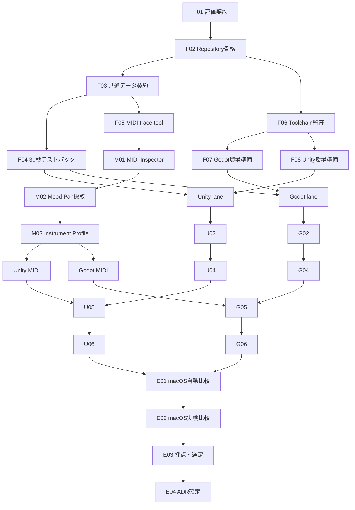

# PanBeat Phase 0 ストーリーバックログ

## 1. 目的

本書は、`architecture.md`で定義したUnity / Godot比較を、Codexの1タスクにつき原則1ストーリーで完了できる単位へ分解した実行バックログである。

Phase 0の終了条件は、ゲーム本体を完成させることではない。**macOS上で、同一条件のUnity / Godot vertical sliceをMood Pan実機と自動試験で比較し、証拠に基づいて一方を選定すること**である。Windowsは初期対象外であり、本バックログの完了条件に含めない。

---

## 2. ストーリー運用ルール

### 2.1 1ストーリーのDefinition of Done

各ストーリーは、個別の受け入れ条件に加えて次をすべて満たした時に完了とする。

- 要求された実装または文書がrepositoryに存在する
- format / static check / relevant testを実行し、結果を報告する
- GUIで行った必要設定がtext fileまたは再現手順として残る
- generated file、cache、credentialを誤ってcommit対象にしない
- 新しいcommandの使い方をREADMEまたは該当文書へ記録する
- 実測値を作った場合はraw dataを残し、要約だけで済ませない
- 未解決事項を成功扱いせず、次のstoryへ渡す条件を明記する
- 変更範囲がstoryの目的から逸脱しない

### 2.2 人間の関与

| 区分 | 意味 |
|---|---|
| Codex完結 | Codexが実装、実行、検証まで行える |
| 承認のみ | install、download、署名等でユーザー承認が必要になる可能性がある |
| 実機共同 | Codexがtoolと手順を用意し、ユーザーがMood Panの接続・打撃を担当する |

ユーザー操作待ちを含むstoryは、待ちに入る前にtool、手順、期待画面、保存先までCodexが準備する。

### 2.3 スコープ制限

Phase 0では次を作り込まない。

- Song Library、Results等の製品画面
- MusicXML全importer
- 本番score balancing
- 高品質な最終art、演出、sound design
- Bluetooth MIDI
- updater、store公開、telemetry
- Practice Mode、Free Play
- Windows build・Windows実機検証

### 2.4 Codexへの依頼方法

各storyは独立したCodex taskで、次の形式で依頼する。

```text
docs/phase0-stories.md の F01 を実施してください。
依存storyの成果物を確認し、記載された受け入れ条件と共通Definition of Doneを
すべて満たしてください。完了時に、変更ファイル、実行した検証、残存課題を報告してください。
```

Codexはstory開始時に依存成果物を確認する。依存が未完了なら勝手に代替実装を広げず、不足を報告する。途中で新しい作業が見つかっても、受け入れ条件に必要でなければ同じtaskへ抱き合わせず、follow-up story候補として記録する。

---

## 3. 全体マップ



Unity laneとGodot laneは、共通fixture完成後は互いに独立して進められる。ただし公平性のため、先に実装した側だけへ有利な仕様変更を入れない。共通仕様を変える場合はF03/F04の成果物と両PoCを同時に更新する。

---

## 4. ストーリー一覧

| ID | ストーリー | 主成果物 | 関与 | 依存 |
|---|---|---|---|---|
| F01 | 評価契約を固定する | `engine-evaluation.md`雛形 | Codex完結 | なし |
| F02 | Phase 0のrepository骨格を作る | directories / commands | Codex完結 | F01 |
| F03 | 共通データ契約を作る | schemas / expected result形式 | Codex完結 | F02 |
| F04 | 30秒テストパックを作る | chart / audio / golden data | Codex完結 | F03 |
| F05 | MIDI trace replay・集計toolを作る | trace CLI | Codex完結 | F03 |
| F06 | Unity / Godot toolchainを監査する | environment report | 承認のみ | F02 |
| F07 | Godot toolchainを準備する | Godot CLI / export templates | 承認のみ | F06 |
| F08 | Unity toolchainを準備する | Unity CLI / license / modules | 承認のみ | F06 |
| M01 | engine非依存MIDI Inspectorを作る | inspector CLI | Codex完結 | F05 |
| M02 | Mood PanのUSB MIDIを採取する | raw JSONL traces | 実機共同 | M01 |
| M03 | Mood Pan Instrument Profileを確定する | profile / mapping tests | Codex完結 | M02 |
| U01 | Unity PoCをscaffoldする | headless buildable project | Codex完結 | F04, F08 |
| U02 | Unity audio transportを実装する | DSP transport / drift log | Codex完結 | U01 |
| U03 | Unity desktop MIDI adapterを実装する | native MIDI input | Codex完結 | U01, M03 |
| U04 | Unityの3種ノーツ表現を実装する | deterministic test scene | Codex完結 | U02 |
| U05 | Unity判定sliceを統合する | replay / judgement / capture | Codex完結 | U03, U04, F05 |
| U06 | Unity hard gateを自己評価する | Unity measurement bundle | Codex完結 | U05 |
| G01 | Godot PoCをscaffoldする | headless buildable project | Codex完結 | F04, F07 |
| G02 | Godot audio transportを実装する | AudioServer transport / drift log | Codex完結 | G01 |
| G03 | Godot標準MIDI adapterを実装する | MIDI input / timestamp log | Codex完結 | G01, M03 |
| G04 | Godotの3種ノーツ表現を実装する | deterministic test scene | Codex完結 | G02 |
| G05 | Godot判定sliceを統合する | replay / judgement / capture | Codex完結 | G03, G04, F05 |
| G06 | Godot hard gateを自己評価する | Godot measurement bundle | Codex完結 | G05 |
| E01 | macOS自動比較を実行する | comparison raw data | Codex完結 | U06, G06 |
| E02 | macOS実機比較を実行する | real-device evidence | 実機共同 | E01 |
| E03 | hard gateとweighted scoreを確定する | decision report | Codex完結 | E02 |
| E04 | engine選定を設計へ反映する | Accepted ADR / repository整理 | Codex完結 | E03 |

---

## 5. Foundation stories

### F01: 評価契約を固定する

**ストーリー:** 開発判断者として、実装前に評価項目と記録形式を固定したい。後から特定engineに有利な基準へ変わらないようにするためである。

**実施内容:** `docs/engine-evaluation.md`の雛形を作り、hardware、OS、engine version、build type、audio設定、hard gate、weighted score、raw data link、GUI介入記録欄を定義する。

**受け入れ条件:**

- `architecture.md` 4.4の全hard gateと重みを転記ではなく参照可能な形で網羅する
- 単位、p50/p95/p99、試行回数、欠測値の扱いを定義する
- 基準変更時の変更理由・日付・承認欄を持つ
- 結論が未記入でも文書としてvalidな雛形になる

### F02: Phase 0のrepository骨格を作る

**ストーリー:** Codexとして、二つのPoCと共通fixtureを混線なく扱いたい。各タスクを同じcommand規約で実行できるようにするためである。

**実施内容:** `pocs/unity`、`pocs/godot`、`shared/fixtures`、`schemas`、`scripts`、`artifacts`の方針を作り、generated outputのignore規則とcommand namingを定義する。

**受け入れ条件:**

- `scripts/check-unity`、`check-godot`、`compare-pocs`のinterfaceを文書化する
- 未実装commandは成功する空stubにせず、明瞭な未実装errorを返す
- raw inputとgenerated reportの保存先が分離される
- engine cache、build output、credentialがignoreされる

### F03: 共通データ契約を作る

**ストーリー:** PoC実装者として、UnityとGodotへ同じ入力と期待結果を渡したい。比較対象をengine実装差だけに絞るためである。

**実施内容:** Phase 0用の最小Chart、Instrument Profile、Raw MIDI Trace、Judgement Record、Run ManifestのJSON Schemaと例を作る。

**受け入れ条件:**

- Tone / Ding / Slapを表現できる
- microsecondまたは十分な精度のtimestampとclock domainを明記できる
- schema versionが必須である
- valid/invalid fixtureとschema validation commandがある
- C#とGDScriptで曖昧になるnull、整数、enumの扱いを定義する

### F04: 30秒テストパックを作る

**ストーリー:** 計測者として、両PoCで完全に同じ音源・譜面・期待結果を使いたい。目視や手入力による比較差をなくすためである。

**実施内容:** 30秒、固定BPM、Tone / Ding / Slap、同時表示、休符を含むchartとclick/audio assetを決定的に生成するscriptを作る。5分drift用には10回loop manifestを作る。

**受け入れ条件:**

- source parameterから何度生成してもchecksumが一致する
- note時刻とaudio click sample位置の期待値がmachine-readableである
- Perfect / Great / Good / Miss境界を含むgolden input/resultを持つ
- audio license上の問題がない自作生成音である
- 30秒試験と5分drift試験をcommandで生成・検証できる

### F05: MIDI trace replay・集計toolを作る

**ストーリー:** Codexとして、Mood Panが接続されていなくても同一入力を何度でも再生・評価したい。判定のregressionとengine比較を自動化するためである。

**実施内容:** JSON Lines traceのvalidation、時刻順replay、速度倍率、summary生成を行うCLIを作る。engine adapterが読む共通fixtureも出力する。

**受け入れ条件:**

- 空、単発、同時刻、高速連打、不正順序traceを扱うtestがある
- original timingと可能な限り同じtimingのreplay modeがある
- deterministicなno-wait modeで判定testに使える
- event数、message種別、channel、note、interval分布を要約できる
- raw traceを変更しない

### F06: Unity / Godot toolchainを監査する

**ストーリー:** Codexとして、PoC開始前に必要なengine、CLI、export module、license状態を確認したい。途中で環境問題により比較が止まらないようにするためである。

**実施内容:** Unity Hub/Editor、Godot、.NET、compiler、macOS build要件をread-onlyで監査し、不足項目とinstall手順をまとめる。必要なinstallは個別承認後に行う。

**受け入れ条件:**

- 使用予定versionと実際のversionを記録する
- CLI pathを環境依存の暗黙値にしない方針を定義する
- headless test/buildが可能か最小commandで確認する
- Unity license/login等、人間操作が必要なblockerを列挙する
- Godot export templateとUnity platform moduleの有無を確認する

### F07: Godot toolchainを準備する

**ストーリー:** Codexとして、Godot PoCに必要なCLIとexport templateを独立して準備したい。Godot実装taskをinstall作業で中断しないためである。

**実施内容:** F06で不足が確認された場合、承認を得て固定versionのGodotとmacOS export templateを導入し、path解決方法とchecksum/versionを記録する。

**受け入れ条件:**

- CLIからversionを取得できる
- headlessで空projectをparse/runできる
- macOS export templateが利用可能である
- install先を個人環境の暗黙PATHだけに依存させない
- download元とchecksumまたは公式version情報を記録する

### F08: Unity toolchainを準備する

**ストーリー:** Codexとして、Unity PoCに必要なEditor、license、macOS moduleを独立して準備したい。Unity実装taskをHub操作や認証で中断しないためである。

**実施内容:** F06で不足が確認された場合、承認を得て固定versionのUnity Editorと必要moduleを導入し、batch modeがlicenseを認識する状態まで確認する。

**受け入れ条件:**

- Editor binaryの絶対pathとversionを取得できる
- batch modeで空projectを開いて正常終了できる
- macOS build moduleが利用可能である
- license/loginに残る人間依存を文書化する
- Unity HubのGUI操作だけに依存しない検査commandがある

---

## 6. Mood Pan stories

### M01: engine非依存MIDI Inspectorを作る

**ストーリー:** デバイス調査者として、engineを選ぶ前にMood Panのraw MIDIを時刻付きで保存したい。mappingとengine挙動を混同しないためである。

**実施内容:** device列挙、port選択、raw byte解釈、monotonic timestamp、session metadata、JSON Lines出力を持つ小さなCLIを作る。

**受け入れ条件:**

- device未接続でもhelp/listが正常動作する
- Note On velocity 0をNote Off相当として解釈しつつraw byteも保持する
- channelを表示上の1始まりとwire値で混同しない
- Ctrl-C等で安全にflushして終了する
- synthetic/virtual MIDIで自動testできる

### M02: Mood PanのUSB MIDIを採取する

**ストーリー:** PanBeat設計者として、各padとSlapの実messageを証拠付きで把握したい。推測mappingを製品へ入れないためである。

**実施内容:** CodexがInspectorを起動し、ユーザーへ順番に全9pad、弱/中/強、Slap位置、Special Pad、押圧、Mute、同時打ち、連打、Tone/Style差の打撃を案内してsessionごとに保存する。

**受け入れ条件:**

- SlapがNoteとして取得されたraw recordを含む
- pad/technique/強度/設定のhuman labelとtraceが対応する
- 取りこぼし、duplicate、Ch.1/2差をsummaryに記録する
- 不完全な奏法は未確認と明記し、推測で埋めない
- 再採取commandと手順が残る

**人間の作業:** Mood PanのUSB接続、指定されたpad/奏法の打撃、必要なTone/Style変更。

### M03: Mood Pan Instrument Profileを確定する

**ストーリー:** engine実装者として、raw MIDIをTone / Ding / Slapへ同じ規則で正規化したい。UnityとGodotのmapping差をなくすためである。

**実施内容:** M02のtraceからPhase 0用Instrument Profileを作成し、全traceに適用して期待target/techniqueとの一致をtestする。

**受け入れ条件:**

- note number、channel、velocity条件がprofileにありcodeへ直書きされない
- Ch.1/2 duplicateがある場合はdedupe規則と時間窓を明記する
- Slap Noteを他padと区別するtestがある
- unknown messageを捨てずdiagnosticへ出す
- mapping coverageと不一致件数がreportされる

---

## 7. Unity stories

### U01: Unity PoCをscaffoldする

**ストーリー:** Codexとして、GUI操作なしでtest/buildできる最小Unity projectがほしい。以後のUnity storyを再現可能に進めるためである。

**実施内容:** version固定、asmdef、scene、batch test/build command、package lock、text serialization、ignore設定を作る。

**受け入れ条件:**

- clean checkout相当からbatch mode testが成功する
- macOS development buildをCLIで生成できる
- scene/prefabがtext serializationされる
- Domain / Infrastructure / Presentationの参照方向をasmdefで表現する
- 手動Editor設定が残る場合は生成scriptまたは手順がある

### U02: Unity audio transportを実装する

**ストーリー:** Unity PoCとして、DSP clockを基準にaudioと譜面時刻を同期したい。frame rateに依存しない判定基準を作るためである。

**実施内容:** `AudioSettings.dspTime`、`PlayScheduled`、start lead、pause/resume、30秒/5分drift loggerを実装する。

**受け入れ条件:**

- `IGameTransport`相当のcontractを満たす
- fake clock unit testがある
- 30秒と5分loopのraw timing logを出せる
- frame stall後もsong timeが正しい位置へ復帰する
- audio setting、sample rate、buffer等をrun manifestへ記録する

### U03: Unity desktop MIDI adapterを実装する

**ストーリー:** Unity PoCとして、Mood Panの入力を高分解能timestamp付きで受けたい。Unityの標準MIDI不在を公平に補うためである。

**実施内容:** RtMidi系またはOS native backendを薄いpluginへ隔離し、port列挙、接続、callback timestamp、queue、切断を実装する。

**受け入れ条件:**

- callbackからUnity APIを呼ばない
- callback内allocationとloggingを避ける
- queue overflowが計測可能でsilent lossしない
- startup後接続、切断、再接続を扱う
- native dependencyのlicense、source/version、build方法を記録する

### U04: Unityの3種ノーツ表現を実装する

**ストーリー:** 視覚評価者として、UnityでTone / Ding / Slapの核心表現を同一assetから確認したい。2D表現力と性能を比較するためである。

**実施内容:** Spawn Ring、Outer Hit Radius、Tone outward、Ding inward、Slap outward、最低限のHIT rippleを作る。位置はtransport timeから直接計算する。

**受け入れ条件:**

- 色を無効化しても3種を形状・方向で識別できる
- 30秒test chartを自動再生できる
- 60/120/144 Hz設定で時刻ベース位置が一致する
- deterministic screenshot/capture commandがある
- object poolを使い定常allocationを計測できる

### U05: Unity判定sliceを統合する

**ストーリー:** Unity PoC利用者として、recorded MIDIと実機MIDIの両方で同じ判定結果を得たい。engine固有入力とDomain判定を統合検証するためである。

**実施内容:** Chart loader、Profile mapper、MIDI/replay adapter、transport、Judgement Engine、簡易HUDを接続する。

**受け入れ条件:**

- F04のgolden resultと完全一致する
- Tone / Ding / Slap、Perfect / Great / Good / Missを通る
- 60/120 Hzと意図的frame stallで判定結果JSONが一致する
- input/audio offsetは比較時0で明示される
- run manifest、judgement、performance logを一括出力する

### U06: Unity hard gateを自己評価する

**ストーリー:** 比較担当者として、Unity単独で欠測のない測定bundleを作りたい。engine間比較前にUnity側の問題を発見するためである。

**実施内容:** release buildで自動replay、30秒、5分drift、frame stall、reconnect、capture、headless test/buildを実行する。

**受け入れ条件:**

- 全hard gateについてPass/Fail/Not Measuredのいずれかを根拠付きで記録する
- raw log、summary、screenshot/video、build artifact metadataが揃う
- clean build時間とGUI介入回数を記録する
- failureを隠す自動retryをしない
- E01が追加加工なしで読めるmanifestを生成する

---

## 8. Godot stories

### G01: Godot PoCをscaffoldする

**ストーリー:** Codexとして、GUI操作なしでtest/buildできる最小Godot projectがほしい。Godotの自律開発性を実測するためである。

**実施内容:** Godot version、typed GDScript、text `.tscn`、headless test、macOS export、Compatibility Renderer、ignore設定を作る。

**受け入れ条件:**

- clean checkout相当からheadless testが成功する
- macOS development exportをCLIで生成できる
- scene/resourceのsource of truthがtextである
- Domain / Infrastructure / Presentationのdirectory境界を持つ
- Web派生を阻害するC#依存をPoCへ入れない

### G02: Godot audio transportを実装する

**ストーリー:** Godot PoCとして、AudioServer/playback clockから安定したsong timeを得たい。Unity DSP transportと同じcontractで比較するためである。

**実施内容:** playback position、time since last mix、output latency、単調増加補正、pause/resume、30秒/5分drift loggerを実装する。

**受け入れ条件:**

- `IGameTransport`と同じobservable behaviorを持つ
- fake clock相当のheadless testがある
- clock値の逆行、jitter、補正回数をraw logへ出す
- frame stall後もsong timeが正しい位置へ復帰する
- audio settingをrun manifestへ記録する

### G03: Godot標準MIDI adapterを実装する

**ストーリー:** Godot PoCとして、標準`InputEventMIDI`でMood Panを受けたい。native pluginなしで精度とlifecycleを満たせるか確認するためである。

**実施内容:** device列挙/open、event normalizer、`_input`到達timestamp、frame情報、接続状態、diagnosticを実装する。

**受け入れ条件:**

- raw情報とnormalized inputの双方を保存できる
- public APIで得られないOS受信timestampを捏造しない
- Note On velocity 0、channel、pressure、CCを正しく保持する
- 起動後接続、切断、再接続の実挙動を記録する
- event到達jitterを測れるraw logを出す

### G04: Godotの3種ノーツ表現を実装する

**ストーリー:** 視覚評価者として、GodotでTone / Ding / Slapの核心表現を同一assetから確認したい。Unityと同じ画面要件で比較するためである。

**実施内容:** Spawn Ring、Outer Hit Radius、3種のmotion、最低限のHIT rippleをGodot 2Dで作る。位置はtransport timeから直接計算する。

**受け入れ条件:**

- U04と同じ解像度、geometry、色なし識別条件を使う
- 30秒test chartを自動再生できる
- 60/120/144 Hz設定で時刻ベース位置が一致する
- deterministic screenshot/capture commandがある
- scene tree node数、allocation、frame timeを記録できる

### G05: Godot判定sliceを統合する

**ストーリー:** Godot PoC利用者として、recorded MIDIと実機MIDIの両方で同じ判定結果を得たい。標準MIDIとAudioServer transportを統合検証するためである。

**実施内容:** Chart、Profile、MIDI/replay、transport、Judgement、簡易HUDを接続する。

**受け入れ条件:**

- F04のgolden resultと完全一致する
- Tone / Ding / Slap、Perfect / Great / Good / Missを通る
- 60/120 Hzと意図的frame stallで判定結果JSONが一致する
- input/audio offsetは比較時0で明示される
- Unityと同じrun manifest、judgement、performance log形式を出す

### G06: Godot hard gateを自己評価する

**ストーリー:** 比較担当者として、Godot単独で欠測のない測定bundleを作りたい。engine間比較前にGodot側の問題を発見するためである。

**実施内容:** export buildで自動replay、30秒、5分drift、frame stall、reconnect、capture、headless test/buildを実行する。

**受け入れ条件:**

- U06と同じhard gate、試行回数、artifact形式を使う
- raw log、summary、screenshot/video、build artifact metadataが揃う
- clean build時間とGUI介入回数を記録する
- failureを隠す自動retryをしない
- E01が追加加工なしで読めるmanifestを生成する

---

## 9. Evaluation stories

### E01: macOS自動比較を実行する

**ストーリー:** 意思決定者として、Unity / Godotの自動試験結果を同一条件で比較したい。実機の人間差を入れる前にengine差を定量化するためである。

**実施内容:** release/export buildをwarm-up後に各3回以上実行し、replay jitter、drift、frame independence、performance、build/test再現性を集計する。

**受け入れ条件:**

- 同じhardware/audio/display条件をrun manifestで確認する
- p50/p95/p99/maxとraw sample数を出す
- missing/failed runを除外せず表示する
- screenshotを同じframe/timeで並べる
- 暫定hard gate結果を出すが、このstoryでは最終選定しない

### E02: macOS実機比較を実行する

**ストーリー:** プレイヤーとして、同じMood PanがUnity / Godot両方で安定して反応することを確認したい。replayでは見えないUSB device挙動を評価するためである。

**実施内容:** Codexが両buildと計測を起動し、ユーザーが同じ台本でTone / Ding / Slap、連打、同時打ち、接続lifecycleを操作する。

**受け入れ条件:**

- 各engineで同じ打撃台本を最低3session実行する
- drop、duplicate、unknown mapping、reconnect結果をraw traceから集計する
- 人間のtimingばらつきをengine dispatch jitterとして採点しない
- 主観メモは定量結果と分けて記録する
- 高速度camera等を使う場合は素材と読み取り方法を保存する

**人間の作業:** 指示された打撃と抜き差し。必要に応じて撮影開始・停止。

### E03: hard gateとweighted scoreを確定する

**ストーリー:** 意思決定者として、収集した証拠から再計算可能なengine選定結果を得たい。好みや事後的な基準変更で決めないためである。

**実施内容:** U06/G06/E01/E02のmanifestを検証し、macOSを正式対象としてhard gate、5点評価、重み付きscore、tie-breakを計算して`engine-evaluation.md`を完成させる。

**受け入れ条件:**

- hard gate Failの候補は総合点に関わらず採用対象外になる
- 各点数にraw evidenceへのlinkと短い根拠がある
- Not Measuredの扱いとrisk acceptanceを明示する
- scriptでscoreを再計算でき、手計算だけにしない
- 推奨engine、言語、固定version、主要な残存riskを示す
- Windowsは未評価の将来移植対象であり、Phase 0の減点や欠測扱いにしない

### E04: engine選定を設計へ反映する

**ストーリー:** 次PhaseのCodexとして、確定した一つのstackだけで迷わず実装を始めたい。Phase 0の仮構成を製品開発構成へ移行するためである。

**実施内容:** ADR-001をAcceptedへ更新し、architectureの候補表現を決定事項と履歴へ分け、採用PoCを`game/`へ移行する計画を実施する。不採用PoCは測定再現可能なtag/branchへ保存する。

**受け入れ条件:**

- `architecture.md`、`engine-evaluation.md`、ADRの結論が一致する
- 採用engine/language/versionと理由が冒頭で分かる
- 不採用理由を削除せずdecision historyとして残す
- Phase 1のbootstrap/check/build commandが採用engineを指す
- temporary comparison artifactと本番sourceの境界が整理される

---

## 10. 推奨実行順

Codex taskは原則として次の順に依頼する。

```text
F01 → F02 → F03 → F04 → F05 → F06 → F07 / F08
                         ↓
M01 → M02（実機共同）→ M03
                         ↓
U01 → U02 → U03 → U04 → U05 → U06
G01 → G02 → G03 → G04 → G05 → G06
                         ↓
E01 → E02（実機共同）→ E03 → E04
```

U02/U03、G02/G03は各scaffold後なら順序を入れ替えられる。Unity laneとGodot laneのどちらを先に完了してもよいが、E01は双方のU06/G06が完了するまで開始しない。

---

## 11. Phase 0完了チェックリスト

- [ ] Mood Pan Slap Noteと全pad mappingがraw traceで確認済み
- [ ] Unity PoCが全共通fixtureを処理できる
- [ ] Godot PoCが全共通fixtureを処理できる
- [ ] macOSの自動比較と実機比較が完了している
- [ ] hard gateが候補ごとにPass/Fail/Not Measuredで埋まっている
- [ ] weighted scoreがscriptで再計算できる
- [ ] Codex自律開発性の実測記録がある
- [ ] `engine-evaluation.md`に最終推奨がある
- [ ] ADR-001がAcceptedになっている
- [ ] 採用engineのPhase 1 commandが一つのtaskで実行可能な状態になっている
