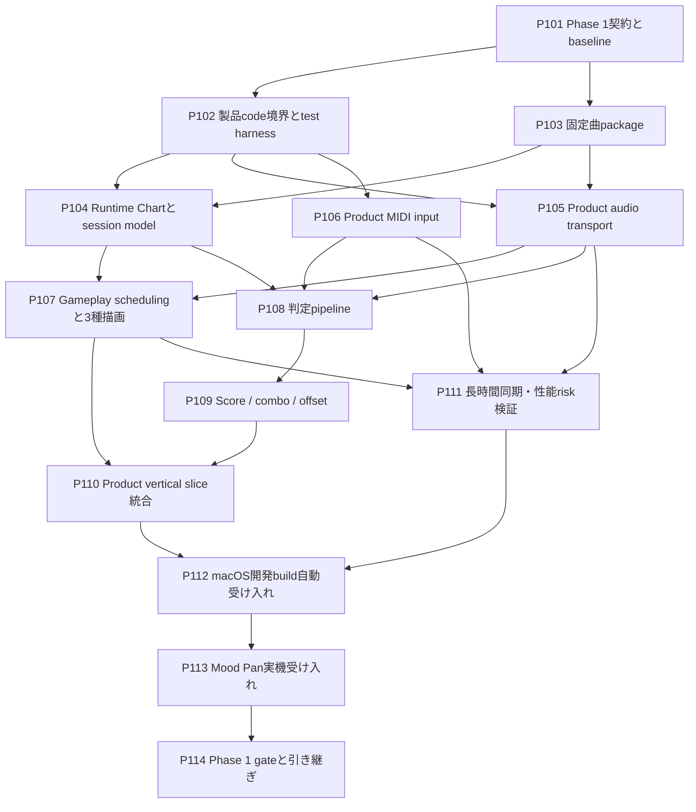

# PanBeat Phase 1 ストーリーバックログ

## 1. 目的

本書は、`docs/architecture.md`で定義したPhase 1「採用エンジンでのProduct Vertical Slice」を、Codexの1タスクにつき原則1ストーリーで完了できる単位へ分解した実行バックログである。

Phase 1の終了条件は、MusicXML対応を含むMVP全体の完成ではない。**Godot 4.6 + typed GDScriptの製品コードで、固定JSON譜面1曲を音源と同期して再生し、Mood PanのUSB MIDIによるTone / Ding / Slap入力を判定し、score / comboと手動offsetを確認できるmacOS開発buildを、実機と自動試験の証拠付きで成立させること**である。

Phase 0の比較PoCは`pocs/`に凍結し、Phase 1の製品実装は`game/`だけで進める。Phase 0の共通schema、fixture、Instrument Profile、recorded MIDI trace、判定期待値は、製品実装の回帰試験へ引き継ぐ。

---

## 2. Phase 1の境界

### 2.1 対象

- Godot 4.6.stable.official.89cea1439 + typed GDScript
- macOS向けデスクトップ開発build
- 固定JSON譜面1曲と、repository内で利用条件を確認できる固定音源
- USB MIDIによるTone Field、Ding、Slap入力
- audio-backed transportを唯一のプレイ時刻とする音源再生
- Perfect / Great / Good / Missの判定
- score、combo、プレイ中または開始前に指定できる手動Input / Audio Offset
- Spawn Ring、Outer Hit Radius、Tone放射、Ding収束、Slap拡大リング、最低限のHIT feedback
- recorded MIDI replayによる決定的な自動試験
- Phase 0から残った5分超drift、release frame time、Godot MIDI dispatch jitterの計測

### 2.2 Phase 2へ送るもの

Phase 1では次を製品機能として作り込まない。

- MusicXML importer、PanBeat overlay、`.mxl`対応
- ユーザーによる曲importとSong Library
- 製品版Device Setup、Calibration、Results画面
- offset自動測定とキャリブレーションUX
- 複数曲、難易度選択、曲メタデータ編集
- 設定・結果履歴の永続化とmigration
- 完成版のエラー画面、アクセシビリティ設定、最終art / sound design
- Practice Mode、Free Play、BPM変更、seek、区間loop、metronome
- Bluetooth MIDI、Web、Windows、署名、公証、store配布
- Chord、Tuplet、Grace Note、Repeat、複数part等の将来譜面機能

Phase 1で必要な診断表示、CLI引数、固定設定ファイル、簡易終了summaryは、Phase 2の製品画面を先取りするものではない。Phase 2で置き換え可能な境界を保つ。

### 2.3 Phase 0からの開始条件

最初のPhase 1ストーリーは、少なくとも次を確認してから開始する。

- `docs/architecture.md`のADR-001がAcceptedで、Godot 4.6 + typed GDScriptが採用済みである
- `game/`が製品entry pointであり、`scripts/check-game --mode test|build|all`が存在する
- canonical Instrument Profileが`shared/fixtures/instrument-profiles/roland-mn10-handpan-minor-v1.json`にある
- Phase 0のchart、golden input/result、recorded MIDI trace、実機比較証拠が参照可能である
- Phase 0で未計測の項目をPassとして扱わず、Phase 1のrisk storyへ引き継げる

不足がある場合は、Phase 1実装へ代替物を混ぜず、Phase 0成果物の修復を別タスクとして報告する。

---

## 3. ストーリー運用ルール

### 3.1 1ストーリーのDefinition of Done

各ストーリーは、個別の受け入れ条件に加えて次をすべて満たした時に完了とする。

- 要求された実装、fixture、文書がrepositoryに存在し、story IDから変更範囲を追跡できる
- `scripts/check-game --mode test`と、そのstoryに固有の検証commandを実行し、実行結果を報告する
- buildまたはrelease挙動へ触れたstoryでは`scripts/check-game --mode build`も実行する
- DomainからGodot API、OS、GUI、ファイルシステムを参照しない
- 判定時刻とノーツ位置をframe countやdelta加算へ依存させず、audio-backed transportから求める
- 新規ロジックに正常系、境界値、失敗系の自動testを追加し、常に成功するmockや空stubを使わない
- GUIでしか再現できない設定を残さず、scene、resource、project設定、CLIまたは文書へ保存する
- 新しいcommand、fixture、設定形式の使い方をREADMEまたは該当文書へ記録する
- 実測値にはengine/build、macOS、hardware、audio設定、入力fixture、実行時刻を含むrun manifestを付ける
- raw trace、drift log、frame-time log、screenshot等の判断証拠を`artifacts/raw/phase1-*`または`artifacts/reports/phase1-*`へ上書きせず保存する
- cache、credential、個人固有のdevice path、不要なbuild outputをcommit対象にしない
- 未実施の検証、残存risk、Phase 2へ送る事項を成功扱いせず明記する
- storyの範囲外で見つけた課題を同じタスクへ抱き合わせない

文書だけを変更するstoryでは、Godot test/buildの代わりにlink、ID、依存関係、用語、Markdown構造の整合性確認を行えばよい。

### 3.2 人間の関与

| 区分 | 意味 |
|---|---|
| Codex完結 | Codexが実装、fixture replay、headless test、build、静的な証拠作成まで行える |
| 承認のみ | install、download、macOS権限、外部tool実行等でユーザー承認が必要になる可能性がある |
| 実機共同 | Codexがbuild、capture tool、手順、保存先を準備し、ユーザーがMood Panの接続・打撃を担当する |

実機共同storyでは、ユーザー操作を依頼する前に、実行可能なbuild、接続確認、操作順、期待表示、失敗時の復旧方法、raw evidence保存先まで準備する。

### 3.3 Codexへの依頼方法

各storyは独立したCodex taskで、次の形式で依頼する。

```text
docs/phase1-stories.md の P101 を実施してください。
依存storyの成果物を確認し、記載された受け入れ条件と共通Definition of Doneを
すべて満たしてください。完了時に、変更ファイル、実行した検証、raw evidence、
残存課題を報告してください。
```

Codexはstory開始時に依存成果物を確認する。依存が未完了なら、同じtaskで依存storyまで実装せず、不足と影響を報告する。

---

## 4. 全体マップ



P103とP102はP101後に並行してよい。P105とP106もP102後に並行できる。P111は計測対象が揃った後に実施し、P112/P113ではロジックの追加を原則行わず、失敗が見つかった場合は原因storyへ戻す。

---

## 5. ストーリー一覧

| ID | ストーリー | 主成果物 | 関与 | 依存 |
|---|---|---|---|---|
| P101 | Phase 1契約とbaselineを固定する | scope / acceptance manifest / baseline report | Codex完結 | Phase 0完了成果物 |
| P102 | 製品code境界とtest harnessを整える | `game/`構造 / test入口 / Phase 0名の解消 | Codex完結 | P101 |
| P103 | 固定曲packageを作る | JSON chart / audio / metadata / checksum | Codex完結 | P101 |
| P104 | Runtime Chartとsession modelを実装する | validated immutable chart / session state | Codex完結 | P102, P103 |
| P105 | Product audio transportを実装する | scheduled playback / pause lifecycle / transport tests | Codex完結 | P102, P103 |
| P106 | Product USB MIDI inputを実装する | port接続 / profile正規化 / diagnostics | Codex完結 | P102 |
| P107 | Gameplay schedulingと3種ノーツ描画を実装する | pooled notes / radial presentation / HIT feedback | Codex完結 | P104, P105 |
| P108 | 判定pipelineを統合する | MIDI/replay共通判定 / judgement records | Codex完結 | P104, P105, P106 |
| P109 | Score、combo、手動offsetを実装する | versioned rules / HUD state / offset injection | Codex完結 | P108 |
| P110 | Product Vertical Sliceを統合する | boot-to-play flow / gameplay HUD /終了summary | Codex完結 | P107, P109 |
| P111 | 長時間同期とrelease性能riskを検証する | drift / frame-time / MIDI dispatch evidence | 承認のみ | P105, P106, P107 |
| P112 | macOS開発buildの自動受け入れを作る | clean build / replay E2E / screenshot / manifest | Codex完結 | P110, P111 |
| P113 | Mood Pan実機で受け入れる | real-device sessions / raw trace / observed result | 実機共同 | P112 |
| P114 | Phase 1 gateを確定しPhase 2へ引き継ぐ | completion report / risk register / architecture更新 | Codex完結 | P113 |

---

## 6. Foundation stories

### P101: Phase 1契約とbaselineを固定する

**ストーリー:** 開発者として、Phase 0から引き継ぐものとPhase 1で証明するものを実装前に固定したい。PoCの成功と製品sliceの完成を混同せず、後から完了条件を緩めないためである。

**実施内容:** Phase 0成果物をread-onlyで監査し、Phase 1の固定曲、profile、判定rule候補、対象build、証拠保存先、検証commandをmachine-readableなacceptance manifestと文書へまとめる。現在の`game/`に対してtest/build baselineを取得する。

**受け入れ条件:**

- 採用engine/version、対象OS、renderer、canonical profile IDとsource pathが記録される
- Phase 0のschema、chart、golden results、recorded trace、ADR、hard-gate evidenceへの参照が列挙される
- Phase 1の対象とPhase 2へ送る項目が本書と矛盾しない
- `scripts/check-game --mode test`と`--mode build`のbaseline結果、実行環境、既知の警告が保存される
- 未計測の5分超drift、release frame time、MIDI dispatch jitterがriskとして登録される
- baseline失敗を後続storyで暗黙に直す前提にせず、blockerまたは修復storyとして区別する

### P102: 製品code境界とtest harnessを整える

**ストーリー:** 製品実装者として、Phase 0から昇格したコードを製品名と責務で扱いたい。以後のstoryがPoC固有のloaderやsceneへ依存しないようにするためである。

**実施内容:** `game/`内をDomain / Application相当 / Infrastructure / Presentationへ整理し、`phase0`という製品外の名前やtest-pack直結を製品code pathから解消する。unit、integration、replay、buildの入口を`scripts/check-game`から再現できるようにする。

**受け入れ条件:**

- 製品runtime codeのclass、scene、設定名に`phase0`が残らない
- DomainはSceneTree、Node、Input、AudioServer、ファイルI/Oを参照しない
- MIDI、clock、chart sourceをfake/replayへ差し替えられる境界がある
- unit testとheadless integration testを別々に失敗判定できる
- `scripts/check-game --mode test|build|all`がcleanな終了codeを返し、失敗を握りつぶさない
- Phase 0の`pocs/`とraw evidenceを変更しない

### P103: 固定曲packageを作る

**ストーリー:** プレイヤーとして、Phase 1の全機能を1回のプレイで確認できる固定曲がほしい。同じ譜面と音源で自動試験と実機試験を繰り返すためである。

**実施内容:** Phase 1専用の固定JSON chart、同期音源、曲metadata、license/provenance、期待イベント、checksumを一つのversioned packageとして作る。Tone / Ding / Slap、休符、複数の密度、score/combo確認に必要な入力を含める。MusicXMLは入力にしない。

**受け入れ条件:**

- package内の相対pathだけでchartとaudioを解決でき、個人環境の絶対pathを含まない
- Tone、Ding、Slap、休符を含み、全noteに安定した一意IDとmicrosecond相当以上の時刻精度がある
- chart終端、audio長、最終noteの関係が検証され、preload/終了余白が明記される
- audioとchartの同期点がmachine-readableで、再生成またはprovenanceとlicenseを確認できる
- package全体のchecksum検証commandがあり、同じ入力から期待値が決定的に得られる
- audio形式候補のdecode、開始、5分超再生、将来のseek/loop上のtrade-offを記録し、Phase 1 runtime形式を決定する
- MusicXML、overlay、ユーザーimportを実装しない

---

## 7. Core runtime stories

### P104: Runtime Chartとsession modelを実装する

**ストーリー:** Gameplay実装者として、固定JSONを検証済みの不変Runtime Chartへ変換し、session状態を画面から独立して管理したい。壊れた譜面やscene順序が判定へ漏れないようにするためである。

**実施内容:** Phase 1 chart loader、schema/semantic validation、Runtime Note index、曲終了条件、session state遷移を実装する。Runtime ChartはPresentationから変更できない構造とし、note時刻順検索を提供する。

**受け入れ条件:**

- schema version、未知のtechnique/target、重複ID、時刻逆順、負時刻、audio範囲外noteを検出する
- Tone / Ding / Slapをcanonical profileのtargetへ解決できる
- 空譜面、壊れたJSON、未知major versionでクラッシュせず具体的な診断を返す
- loading / ready / playing / paused / completed / failedの不正な状態遷移を拒否する
- Runtime Note検索がframe sequenceとscene node順序に依存しない
- P103 packageから生成したgolden Runtime Chartと完全一致する自動testがある

### P105: Product audio transportを実装する

**ストーリー:** プレイヤーとして、音源とノーツが同じ安定した時刻基準で開始・停止してほしい。frame落ちや開始処理の揺れで判定位置が変わらないようにするためである。

**実施内容:** Phase 0のtransportを製品serviceへ昇格し、scheduled start、count-in用の負時刻、pause/resume、完了検出、単調な`NowSec`、run diagnosticsを実装する。Phase 1ではseek/loop UXを実装しない。

**受け入れ条件:**

- audio-backed transportだけがGameplayの現在時刻を提供し、engine frame timeを判定へ使わない
- start lead、sample rate、buffer、output latency、実際の開始anchorをdiagnosticsへ記録する
- start前、再生中、pause中、resume後、終了後の`NowSec`契約が定義される
- pause中は時刻と判定受付が止まり、resume後はaudio位置からanchorを再構築する
- fake audio clockによる境界testと、P103音源を使うheadlessまたはrelease integration testがある
- frame stallを注入しても、復帰後のsong timeが累積deltaではなくaudio位置へ戻る
- audio load/play失敗をsession failureとして返し、無音のまま成功扱いしない

### P106: Product USB MIDI inputを実装する

**ストーリー:** Mood Pan利用者として、製品buildがUSB MIDI portを開き、実測profileどおりにTone / Ding / Slapへ変換してほしい。PoC用capture処理とGameplay入力を混同しないためである。

**実施内容:** Godot標準MIDIのport列挙・選択、open/close lifecycle、Raw MIDI queue、Instrument Profile正規化、診断、recorded trace replay adapterを製品入力境界へ実装する。

**受け入れ条件:**

- Gameplay codeはMIDI note number、channel、port名を直書きせず、canonical profileだけから正規化する
- Note On velocity 0、Note Off、unknown channel/note、CC、Aftertouchを明示的に扱う
- physical inputとrecorded replayが同じ`NormalizedInput` contractを通る
- device未接続、portなし、open失敗をクラッシュさせずdiagnosticへ出す
- startup後接続、close、再openをテストし、Godot APIで物理切断を直接検知できない制約を文書化する
- event受付時刻、frame、queue投入/処理時刻を診断modeで記録でき、callback相当のpathで重いJSON書き込みをしない
- canonical recorded traceで期待するTone / Ding / Slap mappingと一致する自動testがある

### P107: Gameplay schedulingと3種ノーツ描画を実装する

**ストーリー:** プレイヤーとして、実物のTone Field配置と一致する画面で、3種のノーツを色に頼らず見分けたい。視線と打撃位置を自然に対応させるためである。

**実施内容:** Instrument Profileの角度配置、Spawn Ring、Outer Hit Radius、Ding、look-ahead scheduling、object pool、Tone放射、Ding収束、Slap拡大、最低限のHIT/Miss feedbackを製品Gameplay sceneへ実装する。

**受け入れ条件:**

- ToneはSpawn Ringから対象Tone Fieldへ、Dingは中央へ収束、SlapはOuter Hit Radiusへ全周拡大する
- Tone FieldとSlapが同じOuter Hit RadiusをHIT位置として使う
- ノーツ位置を毎frame `transport.NowSec`とexpected timeから直接計算し、位置の累積加算をしない
- profileの角度と短辺基準safe areaから配置し、1280x720以外でも円が楕円にならない
- 色を無効化したcaptureでも形状と移動方向から3種を識別できる
- pool容量不足をsilent dropせず計測し、通常のP103曲再生中に定常的な生成/解放を行わない
- 60/120/144 Hz相当の異なるframe sequenceで、同じtransport timeの位置が許容誤差内で一致する自動testがある

### P108: 判定pipelineを統合する

**ストーリー:** プレイヤーとして、実機MIDIとrecorded replayのどちらでも、target、technique、timingが同じ規則で判定されてほしい。入力経路やframe rateで結果が変わらないようにするためである。

**実施内容:** NormalizedInputをtransport clockへ写像し、未処理note検索、最小絶対delta選択、Perfect / Great / Good、wrong target/technique、Extra Hit、Miss sweep、Judgement Record出力を統合する。

**受け入れ条件:**

- 判定ruleはversion付き設定であり、Perfect / Great / Good / Miss境界と符号規約が明記される
- targetとtechniqueが一致する候補だけを消費し、wrong inputは正しいnoteを消費しない
- 入力候補は判定窓内で絶対deltaが最小の未処理noteを選ぶ
- `currentTime > expectedTime + missWindow`で未処理noteが一度だけMissになる
- Judgement Recordにnote ID、expected/actual transport time、delta、grade、expected/actual target/techniqueが残る
- 判定窓ちょうど内外、早/遅、wrong target、wrong technique、Extra Hit、複数候補、frame stallを含むtestがある
- Phase 0 golden input/resultを変更せず再利用し、60/120/144 Hz相当で結果が完全一致する

### P109: Score、combo、手動offsetを実装する

**ストーリー:** プレイヤーとして、入力結果をscoreとcomboで即時確認し、自分の環境に合わせてInput / Audio Offsetを手動指定したい。Vertical Sliceで判定体験を調整・評価できるようにするためである。

**実施内容:** pureなScore Engine、combo遷移、accuracy用集計、offset適用、簡易HUD modelを実装する。offsetはCLI、固定debug control、またはversioned local configの少なくとも一つから明示的に設定可能にするが、製品Calibration画面と設定migrationはPhase 2へ送る。

**受け入れ条件:**

- score weight、combo break、Extra Hitの扱いがversion付きruleとしてcode外または独立Domain設定にある
- Perfect / Great / Good / Missからscore、accuracy、max combo、判定内訳をpure functionで再計算できる
- `inputOffsetSec`の正値は入力を論理上遅らせ、`audioOffsetSec`の正値は判定対象noteを遅らせる
- offsetは判定時刻へ一度だけ適用され、表示位置または音源そのものへ重複適用されない
- offsetなし、正負offset、境界をまたぐoffsetのgolden testがある
- HUDにcurrent score、combo、直近grade、早い/遅い方向を表示できるmodelがある
- 自動キャリブレーション、製品設定画面、長期設定migrationを実装しない

---

## 8. Integration and acceptance stories

### P110: Product Vertical Sliceを統合する

**ストーリー:** プレイヤーとして、開発buildを起動してから固定曲を最後までプレイし、入力と結果を一つの流れで確認したい。個別componentではなく製品経路が成立していることを確かめるためである。

**実施内容:** composition root、固定曲preload、MIDI/replay mode選択、count-in、Gameplay、pause/resume、曲終了、簡易終了summaryを接続する。専用Song LibraryやResults sceneは作らない。

**受け入れ条件:**

- 起動から固定曲のready、count-in、play、completedまでGUI操作または再現可能なCLIで到達できる
- physical MIDI modeとdeterministic replay modeを起動時に選べ、プレイ中に入力sourceが混ざらない
- audio開始前にchart、profile、audioのpreload/validationが完了する
- Tone / Ding / Slapの表示、入力feedback、判定、score、comboが同じsessionで動作する
- pause中の入力を判定せず、resume後に二重再生、note二重spawn、combo resetの不整合がない
- 曲終了時にscore、accuracy、max combo、Perfect / Great / Good / Missを簡易summaryとして確認できる
- load/audio/MIDIの失敗理由がdeveloper向け診断に出て、false successでGameplayへ進まない
- P103の期待replayで最終summaryがgolden resultと一致するintegration testがある

### P111: 長時間同期とrelease性能riskを検証する

**ストーリー:** 技術判断者として、Phase 0で残った長時間同期、release frame time、MIDI dispatch jitterを製品code pathで測りたい。Vertical Sliceが短いデモだけ偶然動く状態を避けるためである。

**実施内容:** release相当buildで5分以上の連続再生を3回、representative gameplayのframe-time/allocation計測、recorded burst入力と可能ならvirtual/実機MIDIのdispatch計測を行い、raw logとsummaryを保存する。

**受け入れ条件:**

- 5分以上の同一条件runを3回行い、audio/transport driftの各run値とp50/p95/maxを報告する
- 60 fps下限目標に対するframe time、stall、note/effect pool利用量、定常allocationをrelease相当条件で記録する
- MIDI event受付からGameplay queue処理までの遅延をp50/p95/p99で記録し、OS受信timestampが得られない制約と区別する
- frame stall注入後も判定時刻とnote位置がtransportへ復帰することをraw evidenceで示す
- hardware、macOS、Godot、build type、renderer、解像度、refresh rate、audio device/sample rate/buffer、fixture checksumをrun manifestへ記録する
- architectureのMVP目標を満たさない値を隠さず、Phase 1 blockerかPhase 2 riskかを根拠付きで分類する
- raw logをsummary生成時に変更せず、summaryを再生成できるcommandがある

### P112: macOS開発buildの自動受け入れを作る

**ストーリー:** 開発者として、clean checkout相当からPhase 1 buildと代表プレイを一つの入口で再検証したい。後続変更がVertical Sliceを壊したことをすぐ検出するためである。

**実施内容:** `scripts/check-game`へPhase 1 acceptance modeまたは同等の明示的commandを追加し、schema/fixture検証、unit/integration test、release replay、build、artifact検査、deterministic screenshot、manifest生成を自動化する。

**受け入れ条件:**

- 一つのdocumented commandでtest、fixed-song replay、macOS development buildを実行できる
- commandは失敗した段階とlog pathを表示し、途中失敗を最終成功で上書きしない
- buildに固定曲、audio、canonical profile、必要resourceが含まれ、`pocs/`のruntime assetへ依存しない
- build metadataにGit revision、dirty state、Godot version、target、fixture checksumが入る
- deterministic replayのJudgement Recordと終了summaryがgolden resultに一致する
- deterministic screenshotでMood Pan配置、3種note、HUDの主要要素を確認できる
- build内にcredential、raw実機trace、絶対path、不要なdeveloper artifactが含まれない
- acceptance commandを連続2回実行しても前回のraw evidenceを誤って再利用しない

### P113: Mood Pan実機で受け入れる

**ストーリー:** Mood Pan利用者として、recorded replayだけでなく実物のUSB MIDIで固定曲を最後までプレイできることを確認したい。製品入力、音声、描画、判定をend-to-endで受け入れるためである。

**実施内容:** CodexがP112 buildとcapture手順を準備し、ユーザーがMood PanをUSB接続してTone / Ding / Slapを含む固定曲を複数sessionプレイする。接続、入力認識、判定、offset変更、pause/resume、完走を観察し、raw diagnosticと利用者所見を保存する。

**受け入れ条件:**

- Handpan / Minorとcanonical profileを使い、使用device/port/profile/checksumを各runへ記録する
- clean launchからUSB MIDI入力を認識し、Tone / Ding / Slapが期待target/techniqueとして表示される
- 固定曲を最低3 session完走し、各sessionのJudgement Record、summary、diagnosticを別ファイルで保存する
- 少なくとも1 sessionでpause/resumeを確認し、二重再生や入力受付の不整合がない
- 正負いずれかの手動offset変更が判定deltaへ設計どおり反映されることを確認する
- disconnect/reconnectはGodot API制約を踏まえ、再open操作で復旧できるかを記録する。自動復旧はPhase 1必須にしない
- 主観所見とsoftware logを分け、物理打撃から音/画面までのend-to-end latencyをsoftware timestampだけで確定しない
- 未確認のTone/Style、BLE、Pressure、Mute等を対応済みと報告しない

**人間の作業:** Mood PanのUSB接続、Handpan / Minor設定、指示されたTone Field / Ding / Slapの打撃、offset変更前後の試奏、pause/resume、必要な再接続。

### P114: Phase 1 gateを確定しPhase 2へ引き継ぐ

**ストーリー:** プロダクト責任者として、Phase 1が証拠に基づいて完了したかを判断し、Phase 2が暗黙の未完了作業を抱えない状態にしたい。Vertical Sliceの完成とMVPの完成を区別するためである。

**実施内容:** P101のacceptance manifestへ実績を記入し、全story、build、test、実機session、risk測定を監査する。Phase 1 completion reportを作り、必要なarchitecture/README参照を更新し、Phase 2への入力とblockerを一覧化する。

**受け入れ条件:**

- P101からP113までがDoneまたは明示的な未完了であり、未完了を完了扱いしない
- Phase 1完了チェックリストの各項目からtest、build、raw evidence、実機sessionへ辿れる
- 固定曲package、canonical profile、score/judgement rule version、build commandが一意に記録される
- 5分超drift、frame time、MIDI dispatch jitterの結果をarchitectureの目標と比較し、残存riskを更新する
- Phase 1で決めたruntime audio形式と理由を`docs/architecture.md`へ反映する
- Phase 2向けにMusicXML/overlay、import diagnostics、Device Setup、Calibration、Song Library、Results、reconnect、設定保存、end-to-end latencyの前提と未解決事項を渡す
- `docs/requirement.md`のMVP完成条件をPhase 1で達成したとは表現しない
- Phase 0の比較履歴とraw evidenceを変更しない

**2026-08-12 owner decision:** P111で目標未達だった長時間driftとMIDI dispatch p95は、測定値を変更せず`deferred-release-gate-blocker`へ再分類する。Phase 1後の機能開発は継続できるが、[`final-phase-stories.md`](./final-phase-stories.md)のFinal Release Hardeningを完了するまで正式releaseを許可しない。最初のBlocked判断はraw evidenceとして保持する。

---

## 9. 推奨実行順

Codex taskは原則として次の順に依頼する。

```text
P101 → P102 / P103
P102 + P103 → P104 / P105
P102 → P106
P104 + P105 → P107
P104 + P105 + P106 → P108 → P109
P107 + P109 → P110
P105 + P106 + P107 → P111
P110 + P111 → P112 → P113 → P114
```

P102/P103、P105/P106はそれぞれ並行可能である。P111はP105/P106/P107が揃ってから開始し、P112はP110とP111の両方を必要とする。P113で不具合が見つかった場合はP113内で大規模修正せず、原因に対応するstoryを再開して証拠を取り直す。

---

## 10. Phase 1完了チェックリスト

- [ ] `game/`の製品runtime pathからPhase 0固有名と`pocs/`依存が除かれている
- [ ] 固定JSON譜面1曲と同期音源がversion、checksum、license/provenance付きで存在する
- [ ] Tone / Ding / Slapが要件どおり放射・収束・拡大し、共通Outer Hit Radiusを使う
- [ ] audio-backed transportだけを時刻基準として、音源再生、count-in、pause/resume、終了が動作する
- [ ] USB MIDIとrecorded replayが同じ正規化・判定pipelineを通る
- [ ] Perfect / Great / Good / Miss、Extra Hit、Miss sweepがgolden testで再現される
- [ ] score、accuracy、combo、判定内訳がversion付きruleから決定的に計算される
- [ ] Input / Audio Offsetの符号規約がtestと実機で確認される
- [ ] 異なるframe sequenceとframe stallで判定結果が変わらない
- [ ] 5分以上×3回のdrift、release frame time/allocation、MIDI dispatch jitterのraw evidenceがある
- [ ] clean checkout相当から自動test、fixed-song replay、macOS development buildを一つのdocumented commandで再現できる
- [ ] Mood Pan実機で最低3 session完走し、Tone / Ding / Slap、offset、pause/resumeを確認している
- [ ] 未実施検証とGodot MIDI制約を含む残存riskが明記されている
- [ ] Phase 2の対象を先取りせず、引き継ぎ条件がcompletion reportに整理されている
