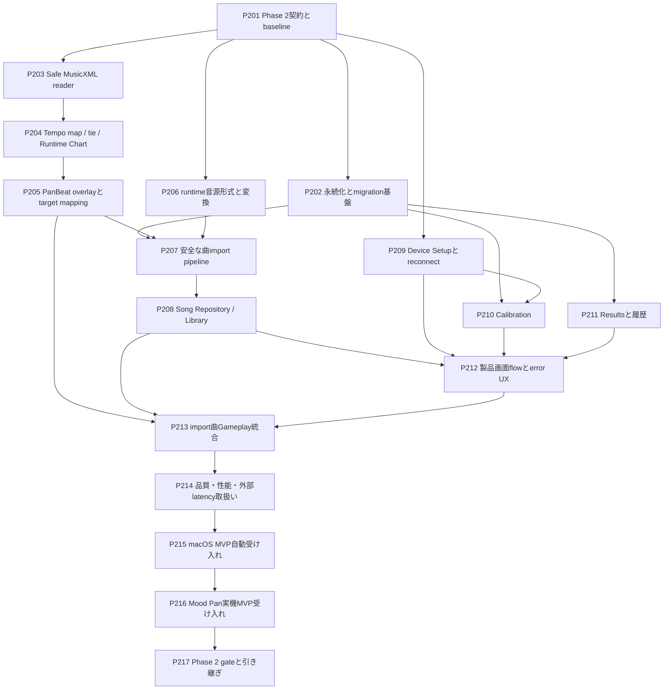

# PanBeat Phase 2 ストーリーバックログ

## 1. 目的

本書は、`docs/architecture.md`で定義したPhase 2「MVP」を、Codexの1タスクにつき原則1ストーリーで完了できる単位へ分解した実行バックログである。

Phase 2の終了条件は、配布可能なrelease candidateの完成ではない。**MusicXML 4.0とPanBeat overlayから安全かつ決定的にRuntime Chartを生成し、ユーザーが曲をimportしてSong Libraryから選択し、Device SetupとCalibrationを経て、Tone / Ding / Slapを含む譜面をMood Panで最後まで演奏し、Resultsを確認できるmacOS MVPを、自動試験と実機証拠付きで成立させること**である。

Phase 1の固定曲とreplayは回帰fixtureとして保持する。長時間driftとMIDI dispatch p95のrelease目標は機能開発を止めないが、`docs/final-phase-stories.md`を完了するまで正式releaseを許可しない。

---

## 2. Phase 2の境界

### 2.1 対象

- MusicXML 4.0 `score-partwise`のMVP subset
- 単一part、単一voice、単音と和音、基本音価、休符、拍子、tempo、基本tempo change、tie
- MusicXMLを音楽原本、PanBeat overlayをSlap等のゲーム注釈とする変換pipeline
- `.musicxml` / `.xml`と、安全に展開する`.mxl`
- ユーザー曲import、validation diagnostics、runtime chart cache
- 長時間曲を含むruntime音源形式の比較と、採用形式への決定的な変換
- Local Song RepositoryとSong Library
- MIDI port/profile選択、Device Setup、入力monitor、reopen/relaunch導線
- Input / Audio OffsetのCalibration、設定保存、schema migration
- Results、判定内訳、早い/遅い分布、ローカル結果履歴
- Boot / Device Setup / Song Library / Calibration / Gameplay / Resultsの製品flow
- import、設定、device、audio、playback失敗の利用者向けerror UX
- macOS MVP build、recorded replay受け入れ、Mood Pan実機受け入れ
- import性能、runtime frame time、外部end-to-end latency測定方法のMVP baseline

### 2.2 Phase 2で対応しないもの

- Tuplet、Grace Note、Repeat、Volta、D.C. / D.S.、複数part、複数voice
- MusicXML内の任意notationからSlapを推測すること
- Practice Mode、BPM変更、seek、区間loop、metronome、左右手ガイド
- Free Play、Pressure、dynamics、Mute、Ghost Note、Roll
- Handpan / Minor以外の未実測Tone / Styleを対応済みとすること
- Bluetooth MIDI、Web、Windows
- 署名、公証、store配布、updater、telemetry
- 最終art、最終sound design、全アクセシビリティ機能
- 楽曲や音源の配布権に関する法務判断
- `docs/final-phase-stories.md`で定義するrelease性能改善とFinal Release Gate

外部latency計測は2026-08-12の製品判断により実施せず、Final Phaseでの再測定も予定しない。software timestampをend-to-end値として扱わず、R-P1-001とR-P1-003をPhase 2の都合で`resolved`へ変更しない。

### 2.3 開始条件

P201を開始する前に、少なくとも次を確認する。

- `docs/phase1-completion-report.md`がPhase 1の完了とPhase 2への引き継ぎを記録している
- Phase 1の自動test、固定曲replay、macOS buildが再現できる
- canonical Instrument Profile、judgement rule、score rule、offset符号規約がversion付きで存在する
- Phase 1の実機sessionとraw evidenceを参照できる
- R-P1-001とR-P1-003が`deferred-release-gate-blocker`としてFinal Phaseへ追跡されている

不足がある場合は、Phase 2内へ代替実装を混ぜず、Phase 1成果物の修復または明示的なblockerとして扱う。

---

## 3. ストーリー運用ルール

### 3.1 1ストーリーのDefinition of Done

各ストーリーは、個別の受け入れ条件に加えて次をすべて満たした時に完了とする。

- 要求された実装、schema、fixture、文書がrepositoryに存在し、story IDから変更範囲を追跡できる
- `scripts/check-game --mode test`と、そのstory固有の検証commandを実行して結果を報告する
- build、import済みasset、製品画面へ触れたstoryでは`scripts/check-game --mode build`も実行する
- DomainからGodot API、OS、GUI、XML parser、ファイルシステムを参照しない
- MusicXML、overlay、Instrument Profile、Runtime Chartの責務を混在させない
- 判定時刻とノーツ位置をframe countへ依存させず、audio-backed transportを唯一の時刻基準にする
- 新規ロジックに正常系、境界値、失敗系の自動testを追加し、空stubや常に成功するmockを使わない
- XML external entity、DTD取得、Zip Slip、zip bomb、path traversal、巨大入力を防ぐtestを追加する
- import元ファイルを変更せず、失敗時に半端な曲や設定をrepositoryへ公開しない
- schema versionとmigrationを必要箇所へ持たせ、未知major versionを具体的な診断付きで拒否する
- GUIでしか再現できない設定を残さず、scene、resource、versioned config、CLI、文書へ保存する
- 新しいcommand、設定形式、import形式の使い方を該当文書へ記録する
- raw evidenceを`artifacts/raw/phase2-*`へ一意のrun IDで保存し、要約で置き換えない
- cache、credential、個人固有path、著作権上commitできないユーザー曲、再生成可能な大型buildをcommitしない
- 未実施検証、残存risk、Final Phaseへの引き継ぎを成功扱いせず明記する
- story範囲外で見つけた課題を同じタスクへ抱き合わせない

文書だけを変更するstoryでは、Godot test/buildの代わりにlink、ID、依存関係、用語、Markdown構造の整合性確認を行えばよい。

### 3.2 人間の関与

| 区分 | 意味 |
|---|---|
| Codex完結 | Codexが実装、fixture、headless test、build、静的証拠まで作成できる |
| 承認のみ | tool導入、外部converter、macOS権限、外部計測等でユーザー承認が必要になる可能性がある |
| 実機共同 | Codexがbuild、手順、記録先を準備し、ユーザーがMood Pan操作や外部計測を担当する |

実機共同storyでは、ユーザー操作を依頼する前に、実行可能なbuild、接続確認、操作順、期待表示、復旧方法、raw evidence保存先まで準備する。

### 3.3 Codexへの依頼方法

各storyは独立したCodex taskで、次の形式で依頼する。

```text
docs/phase2-stories.md の P201 を実施してください。
依存storyの成果物を確認し、記載された受け入れ条件と共通Definition of Doneを
すべて満たしてください。完了時に、変更ファイル、実行した検証、raw evidence、
残存課題を報告してください。
```

依存storyが未完了なら、同じtaskで依存storyまで実装せず、不足と影響を報告する。

---

## 4. 全体マップ



P202、P203、P206、P209はP201後に並行してよい。P210とP211も依存が揃えば並行できる。P215以降では原則として新機能を追加せず、不具合が見つかった場合は原因storyへ戻して証拠を取り直す。

---

## 5. ストーリー一覧

| ID | ストーリー | 主成果物 | 関与 | 依存 |
|---|---|---|---|---|
| P201 | Phase 2契約とbaselineを固定する | scope / acceptance manifest / baseline | Codex完結 | Phase 1完了成果物 |
| P202 | 永続化とschema migration基盤を作る | settings / results / atomic repository | Codex完結 | P201 |
| P203 | Safe MusicXML readerとSymbolic Scoreを実装する | XML reader / score model / diagnostics | Codex完結 | P201 |
| P204 | Tempo Map、Tie、Runtime Chart変換を実装する | deterministic time conversion / golden chart | Codex完結 | P203 |
| P205 | PanBeat overlayとtarget mappingを実装する | overlay schema / Slap annotation / merge | Codex完結 | P204 |
| P206 | runtime音源形式と変換pipelineを決定する | WAV/OGG比較 / converter / ADR | 承認のみ | P201 |
| P207 | 安全でatomicな曲import pipelineを実装する | `.mxl`展開 / validation / package cache | Codex完結 | P202, P205, P206 |
| P208 | Local Song RepositoryとSong Libraryを実装する | library model / import UI / delete flow | Codex完結 | P207 |
| P209 | Device Setupとreconnect導線を実装する | port/profile選択 / input monitor / diagnostics | 実機共同 | P201 |
| P210 | Calibrationとoffset永続化を実装する | calibration flow / versioned offsets | 実機共同 | P202, P209 |
| P211 | Resultsと結果履歴を実装する | result summary / distribution / local history | Codex完結 | P202 |
| P212 | 製品画面flowとerror UXを統合する | Boot-to-Results navigation / recovery UX | Codex完結 | P208, P209, P210, P211 |
| P213 | import曲をGameplayへ統合する | MusicXML-to-play vertical slice | Codex完結 | P205, P208, P212 |
| P214 | MVPの品質・性能・外部latency取扱いを検証する | security/performance evidence / non-execution decision | Codex完結 | P213 |
| P215 | macOS MVP buildの自動受け入れを作る | clean build / import E2E / replay / manifest | Codex完結 | P214 |
| P216 | Mood Pan実機でMVPを受け入れる | real-device import/play/calibration sessions | 実機共同 | P215 |
| P217 | Phase 2 gateを確定しFinal Phaseへ引き継ぐ | completion report / risk register / gate | Codex完結 | P216 |

---

## 6. Foundation stories

### P201: Phase 2契約とbaselineを固定する

**ストーリー:** 開発者として、MVPの入力、出力、対応範囲、証拠を実装前に固定したい。MusicXMLの一部だけを都合よく受理したり、Vertical SliceをMVP完成と混同したりしないためである。

**実施内容:** Phase 1成果物を監査し、Phase 2の対応MusicXML subset、overlay、import package、永続化、画面flow、対象build、security limit、検証commandをmachine-readableなacceptance manifestとbaseline reportへまとめる。

**受け入れ条件:**

- Phase 1 completion reportの全引き継ぎ項目に、Phase 2 storyまたはFinal Phaseの追跡先がある
- MVP対応MusicXML要素と、errorにする未対応要素がfixture単位で列挙される
- `.musicxml` / `.xml` / `.mxl`、overlay、audio、artworkの入力契約とsize limit候補が記録される
- Phase 1固定曲、replay、profile、rules、offset規約を変更せずbaseline test/buildを実行する
- R-P1-001とR-P1-003を未解決のFinal Phase blockerとして参照する
- Phase 2完了と正式release許可を別gateとして定義する

### P202: 永続化とschema migration基盤を作る

**ストーリー:** 利用者として、device、offset、曲、結果の設定が再起動後も安全に残ってほしい。画面ごとに独自ファイルを書き、破損やversion不一致を起こさないためである。

**実施内容:** OS application data directoryを使うSettings、Song metadata、Result History repositoryとmigration runnerを実装する。Domain modelとファイルI/Oを分離し、atomic write、backup/recovery、未知version診断を共通化する。

**受け入れ条件:**

- repository pathはOS APIから解決し、個人固有の絶対pathを保存しない
- schema versionを必須とし、既知versionを段階的にmigrationし、未知major versionを拒否する
- writeはtemporary fileとatomic replaceを使い、中断時に最後の正常データを失わない
- 壊れたJSON、欠落field、権限不足、disk full相当を具体的なerrorへ変換する
- testは一時directoryを使い、利用者の実設定を読み書きしない
- 設定・曲・結果の保持期間と削除責務が分離される

---

## 7. MusicXML・曲import stories

### P203: Safe MusicXML readerとSymbolic Scoreを実装する

**ストーリー:** 譜面作成者として、MVP対応範囲のMusicXMLを正確に読み込み、未対応記法を位置付きで知りたい。黙った情報欠落や危険なXML解決を防ぐためである。

**実施内容:** engine非依存のSymbolic Score modelとSafe XML Readerを実装する。`score-partwise`、part、measure、attributes、divisions、pitch、note/rest、duration、voice、time、sound/metronome tempo、tieを読み、source location付きdiagnosticsを返す。

**受け入れ条件:**

- XML external entity、DTD、network/file entity解決を禁止する
- 単一part / 単一voice制約を検証し、違反位置をpart/measure/elementで示す。`<chord/>` memberは直前のbase noteと同じonsetに正規化する
- divisions変更、休符、拍子、tempo change、tie情報を整数tickのmodelへ保持する
- tuplet、grace、repeat、backup/forward、複数part/voiceを黙って破棄せずunsupported diagnosticにし、不正な位置の`<chord/>`を具体的に診断する
- malformed XML、巨大深度、過大要素数、未知root/versionを安全に拒否する
- MuseScore等からexportした最小fixtureと、valid/invalid/security fixtureの自動testがある

### P204: Tempo Map、Tie、Runtime Chart変換を実装する

**ストーリー:** プレイヤーとして、拍子やtempo変更を含む譜面でもノーツが音楽上の正しい時刻に現れてほしい。XML走査順や浮動小数点累積誤差で判定時刻が変わらないようにするためである。

**実施内容:** Symbolic ScoreからTempo Map、Time Signature Map、tie chain、stable note IDを作り、整数tickを決定的なRuntime Chart時刻へ変換する。

**受け入れ条件:**

- tempo segment開始時刻を確定してからtickを秒へ変換し、noteごとの逐次浮動小数点加算を原本にしない
- measure境界とdivisions変更をまたぐnote/rest/tieを正しく処理する
- tie chainを一つのsustain eventへ正規化し、不正なstart/stopを診断する
- stable IDとsource part/measure/tick/voiceを全runtime noteへ保持する
- tempo change境界、長い曲、measure跨ぎtieのgolden testがある
- 同じ入力・importer versionからbyte単位で同じcanonical chartを生成する

### P205: PanBeat overlayとtarget mappingを実装する

**ストーリー:** 譜面作成者として、MusicXML原譜をPanBeat専用情報で汚さず、Slapやtargetを明示したい。exporter固有notationの推測で奏法を誤らないようにするためである。

**実施内容:** version付きPanBeat overlay schemaを作り、source checksum、note selector、technique、target、難易度情報をSymbolic Scoreへmergeする。pitchからTone targetへのmappingはInstrument Profileまたは明示mappingだけで行う。実音より1オクターブ高いハンドパン記譜は、原譜pitchを保持した明示的なoctave-down import optionで扱う。

**受け入れ条件:**

- overlayはsource MusicXML SHA-256と対応し、不一致ならimportを失敗させる
- note IDまたはpart/measure/tick/voice selectorが一件だけに一致することを検証する
- Slapはoverlayの明示annotationで表現し、MusicXML notationから推測しない
- Tone pitch、Ding、Slapをcanonical target/techniqueへ解決できる
- 「1オクターブ高く記譜」を選んだ場合だけtarget解決pitchを12 semitone下げ、選択内容をcache keyとpackage metadataへ保持する
- NotePan `<unpitched>`の`g`を無視し、単独の`S`と`T`をSlapへ解決する。`S+6`や`T+1`等ではMood PanでTone Fieldとの和音を演奏できないため`S`/`T`側を無視し、pitched chord memberだけを保持する
- 未対応pitchはsource位置付きwarningとして対象noteだけを無視し、対応pitchのimportを継続する。存在しないtarget、重複selector、複数一致、未使用annotationは具体的なerrorとして拒否する
- overlayなしで表現可能なTone/Ding譜面と、overlay付きSlap譜面のgolden testがある

### P206: runtime音源形式と変換pipelineを決定する

**ストーリー:** 曲をimportする利用者として、一般的な音源を扱いつつ、長時間曲でも同期、容量、再生開始が安定してほしい。Phase 1の短いWAV判断を根拠なく全曲へ拡張しないためである。

**実施内容:** 6分以上の同一素材をWAVとGodotで利用可能なOGG候補で比較し、容量、decode、変換時間、開始、pause/resume、終了位置、将来のseek/loop継ぎ目を測る。入力形式とcanonical runtime形式をADRへ固定し、決定的な変換・検証commandを作る。

**受け入れ条件:**

- converter名、version、license、導入方法、再現commandが記録される
- WAV/OGGを同じsource、sample rate、channel条件で比較し、checksumとraw evidenceを保存する
- 少なくとも6分素材でdecode、開始、pause/resume、完走、終了位置を3回測定する
- unsupported codec、壊れたaudio、過大duration、sample rate/channel不一致を診断する
- import元を変更せず、canonical assetを一時領域へ生成して検証後に公開する
- 採用形式と入力許可形式をarchitectureへ反映し、未検証形式を対応済みとしない

### P207: 安全でatomicな曲import pipelineを実装する

**ストーリー:** 利用者として、譜面・overlay・任意の伴奏音源を選ぶと、問題箇所を確認してから曲を追加したい。Mood Pan本体の音だけで演奏する曲も扱いながら、壊れたbundleや悪意あるarchiveで既存libraryを破損させないためである。

**実施内容:** `.musicxml` / `.xml` / `.mxl`、任意のoverlay、任意のaudioをstaging directoryへ取り込み、schema/semantic/security validation、指定時のaudio変換、Runtime Chart生成、cache key作成、atomic commitを行うApplication serviceを実装する。audioなしでは譜面durationをpackage durationとして保存する。

**受け入れ条件:**

- `.mxl`のcontainer rootfileを解決し、Zip Slip、symlink、absolute path、zip bomb、entry数/展開size超過を拒否する
- source path、extension、size、checksumを検査し、元ファイルを変更しない
- audioを指定しない曲を受理し、runtime audio assetを要求せず譜面durationで再生できる
- diagnosticsにseverity、code、file、part/measure/elementまたはoverlay location、修正方針を含める
- importer/source/overlay/profileのversionまたはchecksum変更時にcacheを無効化する
- import失敗・cancel・process中断で半端な曲がSong Repositoryへ現れない
- 同一contentの重複import方針と、既存曲更新時のID/version規則がtestと文書にある

### P208: Local Song RepositoryとSong Libraryを実装する

**ストーリー:** プレイヤーとして、importした曲を一覧から選び、問題のある曲を再検証または削除したい。ファイル配置を直接操作せずに曲を管理するためである。

**実施内容:** Local Song Repository、library query、import/reimport/delete UIを作る。タイトル、作者、duration、譜面version、profile compatibility、validation status、artworkを表示する。

**受け入れ条件:**

- library一覧はrepository metadataから決定的に構築され、壊れた一曲で全体が開けなくならない
- empty、loading、valid、warning、invalidの状態を色だけに依存せず表示する
- import/reimportのdiagnosticsへ画面から到達できる
- deleteは対象曲と関連cacheを正確に提示し、利用者確認後に実行する
- repository外のsource MusicXML/audioを削除または変更しない
- keyboard操作、focus順、最低限の文字サイズ・contrastを確認する

---

## 8. Device・Calibration・Results stories

### P209: Device Setupとreconnect導線を実装する

**ストーリー:** Mood Pan利用者として、利用可能なMIDI portとprofileを確認し、入力monitorを見ながら接続を復旧したい。`no ports`や無音状態で原因が分からないまま判定付きGameplayへ進まず、必要なら未接続エラーを表示したview-only Gameplayでノートだけを確認できるようにするためである。

**実施内容:** Device Setup画面、open-before-enumerate lifecycle、port/profile selection、入力monitor、reopen、diagnostic history、必要時のrelaunch案内を実装する。

**受け入れ条件:**

- clean processで`open_midi_inputs`後にportを列挙する順序をintegration testで固定する
- portなし、open失敗、未対応device、profile不一致を区別して表示する
- raw note numberだけでなく正規化したTone / Ding / Slapとtargetを入力monitorへ表示する
- reopen操作は二重登録やevent duplicateを起こさず、成功/失敗履歴を残す
- Godotのport listや無音だけで物理切断を断定せず、制約とrelaunch手順を表示する
- Mood Pan接続、起動後接続、切断、再接続を実機で確認し、raw diagnosticを保存する

**人間の作業:** Mood Panの接続、Handpan / Minor設定、指定パッドの打撃、切断・再接続、必要なmacOS権限操作。

### P210: Calibrationとoffset永続化を実装する

**ストーリー:** プレイヤーとして、自分のdevice/audio環境に合うInput / Audio Offsetを理解して調整し、次回も使いたい。内部符号を推測させずに判定位置を合わせるためである。

**実施内容:** 既知時刻の刺激とMood Pan入力を使うCalibration flow、手動fine-tune、sample集計、外れ値表示、profile/audio-device別offset保存、migrationを実装する。

**受け入れ条件:**

- `inputOffsetSec`と`audioOffsetSec`の既存符号規約を変えず、「早く/遅く判定される」の説明を表示する
- Calibration sampleは刺激時刻、入力時刻、delta、device/profile/audio設定とともに保存する
- sample不足、ばらつき過大、Extra Hit、Missを成功値へ混ぜず、再試行を案内する
- 自動提案値を利用者が確認・調整・resetでき、適用前後を区別する
- offsetをprofileとaudio output条件へ関連付け、再起動後に復元する
- recorded inputによる決定的testとMood Pan実機による正負offset確認がある

**人間の作業:** Calibration画面の指示に合わせたTone/Ding打撃、提案値の試奏、必要に応じた手動調整。

### P211: Resultsと結果履歴を実装する

**ストーリー:** プレイヤーとして、演奏後にscoreだけでなく、どこで早い・遅い・奏法違いがあったか確認したい。次の練習とCalibration判断につなげるためである。

**実施内容:** Phase 1 Judgement RecordからResults view modelを作り、score、accuracy、max combo、grade内訳、Extra Hit、delta分布、曲/profile/rule versionを表示・保存する。

**受け入れ条件:**

- score、accuracy、combo、grade内訳がversion付きruleの再計算結果と一致する
- deltaのmedianと早い/遅い分布を表示し、Missのnull時刻を数値へ捏造しない
- wrong target/techniqueとExtra Hitを通常のtiming missから区別する
- result recordにsong/importer/chart/profile/judgement/score rule versionを保持する
- 履歴上限、削除、破損record隔離、schema migrationがtestされる
- 色だけに依存せずgradeと傾向を識別できる

### P212: 製品画面flowとerror UXを統合する

**ストーリー:** 初めての利用者として、起動から接続、曲選択、調整、演奏、結果確認まで迷わず進み、失敗時には復旧できる状態で止まりたい。CLI診断を読まなければ使えないMVPにしないためである。

**実施内容:** Boot、Device Setup、Song Library、Calibration、Gameplay、ResultsのApplication stateと画面遷移を統合する。recoverable/fatal error、retry、戻る、診断詳細のUXを共通化する。

**受け入れ条件:**

- 初回起動、設定済み起動、deviceなし、曲なしの開始先が明確である
- 不正な画面遷移と二重session開始をApplication層で拒否する
- import/device/audio/settings/playback errorに利用者向け説明、技術詳細、復旧操作がある
- retry/cancel/backでresource、MIDI port、temporary importを残さない
- keyboardだけで主要flowを操作でき、focus消失やfocus trapがない
- CLI/replay起動は自動受け入れ用に維持し、製品flowと同じApplication serviceを通る

---

## 9. Integration・acceptance stories

### P213: import曲をGameplayへ統合する

**ストーリー:** プレイヤーとして、自分でimportしたMusicXML曲を固定曲と同じ判定・描画品質で演奏したい。importerとGameplayが別々に成功するだけでなくMVPの価値を成立させるためである。

**実施内容:** import済みRuntime Chart/audio/profileを既存Game Sessionへ渡し、preload、count-in、play/pause、完了、Results遷移を統合する。Tone / Ding / Slap、tempo change、tieを含む権利上commit可能なMVP acceptance songを用意する。

**受け入れ条件:**

- MusicXML + overlay + audioから生成した曲をSong Libraryから開始できる
- Tone / Ding / Slapが実物配置と一致し、放射・収束・拡大表現と判定pipelineを再利用する
- tempo changeとtieを含む期待時刻がgolden Runtime Chart、描画、判定で一致する
- audio-backed transportだけを時刻基準にし、pause/resume後もchartとaudioが一致する
- completed sessionからResultsへ一度だけ遷移し、結果履歴へ一度だけ保存する
- Phase 1固定曲replayの判定結果が回帰していない

### P214: MVPの品質・性能・外部latency取扱いを検証する

**ストーリー:** 開発判断者として、MVPのimport規模、画面性能、安全性、体感latencyの既知範囲を証拠付きで把握したい。Final Phaseへ隠れた測定作業や安全性欠陥を渡さないためである。

**実施内容:** 大規模だが許容範囲のMusicXML/.mxl、長時間audio、多曲library、note密度を使ってimport時間、memory、frame time、allocation、cache挙動を測る。end-to-end latencyはsoftware timestampで確定せず、外部計測を実施しない製品判断と将来actionなしを記録する。

**受け入れ条件:**

- fixture規模、hardware、OS、Godot/build、audio設定、測定tool、試行回数をmanifestへ記録する
- import時間、peak memory、package/cache容量、Gameplay frame p95/p99、pool不足をraw evidence付きで報告する
- XXE、Zip Slip、zip bomb、path traversal、巨大入力、壊れたcacheのnegative testを実行する
- 物理打撃→MIDI→判定→画面/音の測定点を分離し、software timestampだけでend-to-end値を確定しない
- 外部計測は2026-08-12の製品判断により実施しない。未実施理由、software timestampをend-to-end値としないこと、将来actionなしをdecision recordへ記録する
- R-P1-001/R-P1-003のFinal Phase gateを緩和または解決済みにしない

**人間の作業:** 外部latency計測は実施しないため、機材接続、撮影、データ提供は不要。

### P215: macOS MVP buildの自動受け入れを作る

**ストーリー:** 開発者として、clean checkout相当からMVP build、曲import、replay、Resultsまでを一つの入口で再検証したい。後続変更がimport済みGameplayを壊したことを即座に検出するためである。

**実施内容:** test、acceptance song import、package inspection、macOS build、release executable replay、screenshot、Results照合、manifest生成を一つのscriptへまとめ、独立run IDで2回実行する。

**受け入れ条件:**

- clean checkout相当から一つのdocumented commandでtest/import/build/replay/screenshotを実行できる
- buildに必要なMusicXML/overlay/audio/schema/profile/rulesだけが含まれ、raw evidenceや個人pathを含まない
- release executableがacceptance songをimportまたは事前配置した同一pipelineから完走する
- replayのJudgement Record、Results、保存後readbackがgolden結果と一致する
- 2回の独立runでcanonical chartとreplay結果が決定的に一致する
- build archive、log、screenshot、manifestを一意のrun IDで保存し、失敗を成功扱いしない

### P216: Mood Pan実機でMVPを受け入れる

**ストーリー:** Mood Pan利用者として、実際の曲importからCalibration、演奏、Resultsまでを実機で完了したい。replayでは確認できない接続、打撃、復旧、理解しやすさを受け入れるためである。

**実施内容:** CodexがP215 build、acceptance song、操作runbook、診断保存先を準備し、ユーザーがclean launchからDevice Setup、import、Calibration、Gameplay、Results、再起動後の設定復元を複数sessionで確認する。

**受け入れ条件:**

- Handpan / Minorとcanonical profileを使い、device/port/profile/audio/build/checksumを各runへ記録する
- clean launchからport/profileを選び、入力monitorでTone / Ding / Slapを確認できる
- MusicXML + overlay + audioを製品UIからimportし、診断を確認してSong Libraryへ追加できる
- Calibrationを実行し、保存offsetがGameplayと再起動後へ反映される
- acceptance songを最低3 session完走し、pause/resume、Results、履歴を確認する
- 少なくとも1回、切断後のreopenまたはrelaunch導線で復旧を確認する
- 主観所見、software diagnostic、外部latency evidenceを区別して保存する

**人間の作業:** Mood Pan接続・設定・打撃、曲ファイル選択、Calibration、pause/resume、切断・再接続、Results確認、主観所見の記録。

### P217: Phase 2 gateを確定しFinal Phaseへ引き継ぐ

**ストーリー:** プロダクト責任者として、MVP機能が証拠に基づいて完成したかを判断し、release可能性とは区別してFinal Phaseへ渡したい。機能完成とrelease許可を混同しないためである。

**実施内容:** P201 acceptance manifestへ実績を記入し、全story、security test、build、実機session、残存riskを監査する。Phase 2 completion reportとFinal Phase handoffを作り、必要なarchitecture更新を行う。

**受け入れ条件:**

- P201からP216までがDoneまたは明示的な未完了であり、未完了を完了扱いしない
- Phase 2完了チェックリストの各項目からtest、build、raw evidence、実機sessionへ辿れる
- MusicXML subset、overlay schema、importer、runtime audio、profile、rules、settings migrationのversionが一意に記録される
- import/security/performance/end-to-end latencyの結果と未実施項目をrisk registerへ反映する
- `docs/requirement.md`のMVP完成条件を満たしたか、文言ではなくacceptance evidenceで判定する
- R-P1-001/R-P1-003と、Phase 2で残ったrelease blockerをFinal Phaseへ引き継ぐ
- Final Phase完了前に正式release、署名、公証、配布可能と表現しない
- Phase 0/1のdecision historyとraw evidenceを変更しない

---

## 10. 推奨実行順

Codex taskは原則として次の順に依頼する。

```text
P201
  → P202 / P203 / P206 / P209
P203 → P204 → P205
P202 + P205 + P206 → P207 → P208
P202 + P209 → P210
P202 → P211
P208 + P209 + P210 + P211 → P212
P205 + P208 + P212 → P213
P213 → P214 → P215 → P216 → P217
```

P202/P203/P206/P209は並行可能である。P206で外部converter導入が必要な場合、承認待ちの間にP202/P203/P209を進めてもよい。P216で不具合が見つかった場合はP216内で大規模修正せず、原因storyへ戻して自動受け入れから証拠を取り直す。

---

## 11. Phase 2完了チェックリスト

- [x] Phase 1固定曲、replay、Tone / Ding / Slap、score/combo/offsetが回帰していない
- [x] MusicXML 4.0のMVP subsetを安全に読み、未対応要素を位置付きで診断する
- [x] tempo change、拍子、休符、tieから決定的なRuntime Chartを生成する
- [x] PanBeat overlayでSlapとtargetを明示し、原譜checksum不一致を拒否する
- [x] `.musicxml` / `.xml` / `.mxl`と音源を安全かつatomicにimportできる
- [x] 長時間曲のruntime音源形式が比較証拠とADRに基づいて決定されている
- [x] Song Libraryでimport、診断、reimport、選択、削除を操作できる
- [x] Device Setupでport/profile選択、入力monitor、reopen/relaunch導線を利用できる
- [x] Calibrationでoffsetを測定・調整・保存し、符号規約どおりGameplayへ反映する
- [x] Resultsでscore、accuracy、max combo、grade内訳、早い/遅い分布を確認できる
- [x] 設定、曲metadata、結果履歴がversion付きschemaとmigrationで安全に永続化される
- [x] BootからResultsまでの製品flowと、主要失敗からの復旧UXが成立する
- [x] importしたTone / Ding / Slap曲をaudio-backed transportで最後まで演奏できる
- [x] import security、規模、frame time、memory、cacheの測定証拠がある
- [x] 外部end-to-end latencyは測定点を分離し、実施しない製品判断とsoftware値を代用しない制約が記録されている
- [x] clean checkout相当からmacOS MVP buildとimport/replay受け入れを一つのcommandで再現できる
- [x] Mood Pan実機で最低3 session、import、Calibration、演奏、Results、再接続を確認している
- [x] R-P1-001/R-P1-003を含むrelease blockerがFinal Phaseへ明示的に引き継がれている
- [x] MVP機能完成と正式release許可を混同していない
