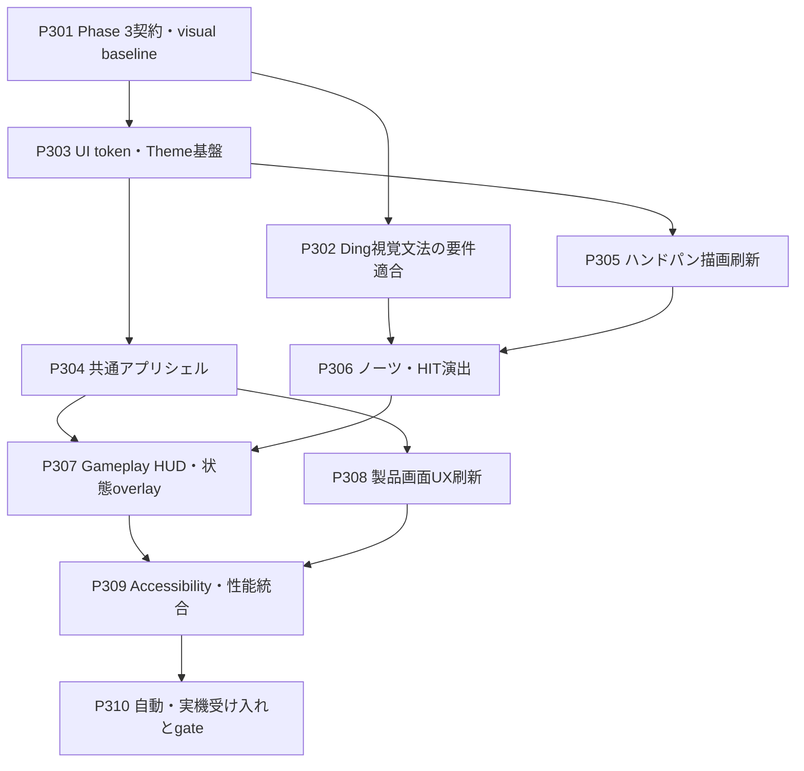

# PanBeat Phase 3 ストーリーバックログ

## 1. 目的

本書は、`docs/architecture.md`で定義するPhase 3「UI / Visual Polish」を、Codexの1タスクにつき原則1ストーリーで完了できる単位へ分解した実行バックログである。

Phase 3の終了条件は、**Phase 2で成立したmacOS MVPの機能、audio-backed transport、判定結果、実機配置を変えず、放射・収束・拡大というPanBeat固有の視覚文法を要件どおり実装し、ハンドパン音楽ゲームとして一貫した外観、読みやすいゲームプレイ、明確な製品画面flowを、自動試験、screenshot、性能測定、Mood Pan実機確認付きで成立させること**である。

従来Phase 3候補だったPractice Mode、左右手ガイド、苦手箇所分析、Free Play、Pressure / dynamicsは発展的な学習機能であり、2026-08-12の製品判断により本Phaseでは実施しない。未実装をPhase 3のblockerまたはFinal Phaseの必須作業として扱わない。

Phase 3はrelease許可ではない。長時間driftとMIDI dispatch p95を含むrelease gateは、引き続き`docs/final-phase-stories.md`で扱う。

---

## 2. Phase 3の境界

### 2.1 対象

- 現行画面と代表状態のvisual baseline、UI token、デザイン仕様
- Dingノーツを全周リング＋内向き収束へ直す要件適合修正
- Tone / Ding / Slapの形状、方向、移動、HIT位置による視覚的識別
- 幻想的な瞑想背景に半透明の銅色ハンドパンが浮かぶゲームフィールド
- 共通Theme、font、color、spacing、focus、button、panel、status表現
- PanBeat共通アプリシェルとnavigation
- ハンドパン本体、Ding、Tone Field、Spawn Ring、Outer Hit Radiusの描画刷新
- Spawn、HIT、Perfect / Great / Good / Miss、Comboの局所演出
- Gameplay HUD、count-in、pause、complete、failure状態
- Device Setup、Song Library、Calibration、Results、error UXの情報設計と外観改善
- Glow無効、monochrome、高コントラスト、キーボード操作
- 起動時maximized、1600×900をreference、1280×720を下限基準とするresize対応、screenshot regression、frame time / allocation確認
- macOS buildとMood Pan実機による一曲通しの視認性確認

### 2.2 デザイン方向

- 背景はハンドパンの瞑想性に合う幻想的なshaderとし、曲時刻に同期した穏やかだが認識可能な動きを与える
- ハンドパンは半透明の銅色、同心円、弱い金属光沢で表現し、背景を透過させる
- Toneは局所的な発光オーブ、Dingは収束する全周リング、Slapは拡大する全周リングとする
- Techniqueと判定は色だけに依存せず、形状、移動方向、線種、局所feedbackでも識別可能にする
- 発光とBloomは次のノーツとHIT時刻の理解を妨げない強さにし、Toneの追従trail、HIT時の放射線、Missの×印は使用しない
- 全画面flashと恒常的なcamera shakeを使わない
- Score、Combo、Accuracy等のGameplay情報は短く大きく表示し、技術情報は詳細表示へ分離する
- 装飾を無効化してもゲームに必要な情報を失わない

色相やfontの最終値はP301の比較案と承認証拠で固定する。上記の視覚文法とアクセシビリティ制約は比較案によって変更しない。

### 2.3 Phase 3で対応しないもの

- Practice Mode、BPM変更、seek、区間loop、metronome
- 左右手ガイド、苦手箇所分析、練習推薦
- Free Play
- Pressure、dynamics、Mute、Ghost Note、Rollと、それらのschema拡張
- 新しいscore、judgement、combo、offsetルール
- 新しいMusicXML要素、import形式、Instrument Profile
- native CoreMIDI adapter、Godot MIDI hot-plug制約の解消
- Web、Windows、Bluetooth MIDI
- 署名、公証、store配布、updater、telemetry
- 楽曲、ロゴ、font、画像素材の権利処理を推測で完了扱いすること
- `docs/final-phase-stories.md`のrelease性能改善とFinal Release Gate

### 2.4 開始条件

P301を開始する前に、少なくとも次を確認する。

- `docs/phase2-completion-report.md`がPhase 2の完了と残存riskを記録している
- Phase 2の自動test、import/replay受け入れ、macOS buildを再現できる
- Tone / Ding / Slapを含む固定chart、recorded replay、代表画面のscreenshotを参照できる
- Gameplayの位置と判定がaudio-backed transportから導出されている
- R-P1-001とR-P1-003がFinal Phaseのrelease blockerとして追跡されている

不足がある場合は、UIへ代替ロジックを混ぜず、原因storyの修復または明示的なblockerとして扱う。

---

## 3. ストーリー運用ルール

### 3.1 1ストーリーのDefinition of Done

各ストーリーは、個別の受け入れ条件に加えて次をすべて満たした時に完了とする。

- 要求された実装、resource、fixture、文書がrepositoryに存在し、story IDから変更範囲を追跡できる
- `scripts/check-game --mode test`と、そのstory固有の検証commandを実行して結果を報告する
- 製品画面、asset、Theme、shaderへ触れたstoryでは`scripts/check-game --mode build`も実行する
- Domain、Application、Infrastructureの契約をPresentation都合で変更せず、UI状態を判定結果の原本にしない
- 判定時刻とノーツ位置をframe countへ依存させず、既存のaudio-backed transportを唯一の時刻基準にする
- Tone Field角度、Ding / Spawn / Outer Hit半径の座標契約をversionなしに変更しない
- 新規の描画計算と状態変換に正常系、境界値、失敗系の自動testを追加し、目視だけで完了させない
- 1280×720と代表的なwide windowで、切れ、重なり、楕円化、読めない文字がないことを確認する
- 色だけに依存せず、keyboard focus、disabled、error、loading、empty状態を識別可能にする
- Glow無効設定で発光を無効化でき、flashを使用しない
- assetの出典、license、加工条件を記録し、権利不明assetと個人環境だけのfontをcommitしない
- GUIでしか再現できない設定を残さず、`.tscn`、`.tres`、shader、versioned config、CLI、文書へ保存する
- deterministic screenshotと必要なraw計測を`artifacts/raw/phase3-*`へ一意のrun IDで保存する。これはローカル／CI証跡でありGitへcommitしない
- cache、credential、個人固有path、再生成可能な大型buildをcommitしない
- 未実施検証、視認性上の懸念、性能risk、Final Phaseへの引き継ぎを成功扱いせず明記する
- story範囲外で見つけた課題を同じタスクへ抱き合わせない

文書だけを変更するstoryでは、Godot test/buildの代わりにlink、ID、依存関係、用語、Markdown構造の整合性確認を行えばよい。

### 3.2 人間の関与

| 区分 | 意味 |
|---|---|
| Codex完結 | Codexが実装、fixture、headless test、build、静的証拠まで作成できる |
| デザイン共同 | Codexが比較可能な案とscreenshotを準備し、ユーザーが製品方向を選択する |
| 実機共同 | Codexがbuild、手順、記録先を準備し、ユーザーがMood Panで視認性と操作感を確認する |

デザイン共同storyでは、抽象的な好みだけを尋ねず、同一fixture、同一時刻、同一解像度の比較画像と差分を準備する。実機共同storyでは、ユーザー操作を依頼する前に、実行可能なbuild、接続確認、操作順、期待表示、復旧方法、raw evidence保存先まで準備する。

### 3.3 Codexへの依頼方法

各storyは独立したCodex taskで、次の形式で依頼する。

```text
docs/phase3-stories.md の P301 を実施してください。
依存storyの成果物を確認し、記載された受け入れ条件と共通Definition of Doneを
すべて満たしてください。完了時に、変更ファイル、実行した検証、raw evidence、
残存課題を報告してください。
```

依存storyが未完了なら、同じtaskで依存storyまで実装せず、不足と影響を報告する。

---

## 4. 全体マップ



P302とP303はP301後に並行してよい。P304とP305もP303後に並行できる。P306以降は視覚文法とtheme基盤を固定してから進める。P310では原則として新しい演出を追加せず、不具合が見つかった場合は原因storyへ戻して証拠を取り直す。

---

## 5. ストーリー一覧

| ID | ストーリー | 主成果物 | 関与 | 依存 |
|---|---|---|---|---|
| P301 | Phase 3契約、visual baseline、デザイン方向を固定する | acceptance manifest / baseline screenshots / design tokens proposal | デザイン共同 | Phase 2完了成果物 |
| P302 | Dingノーツを収束する全周リングへ修正する | kinematics / ring rendering / conformance tests | Codex完結 | P301 |
| P303 | UI tokenと共通Theme基盤を実装する | palette / typography / StyleBox / focus / asset manifest | デザイン共同 | P301 |
| P304 | 共通アプリシェルとnavigationを刷新する | app shell / MIDI status / error presentation | Codex完結 | P303 |
| P305 | ハンドパン本体とゲームフィールドを刷新する | layered field / metal styling / judgement-decoration separation | Codex完結 | P303 |
| P306 | ノーツ、判定feedback、Combo演出を刷新する | technique visuals / bloom / accessibility fallback | Codex完結 | P302, P305 |
| P307 | Gameplay HUDと状態overlayを刷新する | HUD / count-in / pause / complete / failure | Codex完結 | P304, P306 |
| P308 | Device、Songs、Calibration、ResultsのUXを刷新する | product screens / empty-loading-error states | Codex完結 | P304 |
| P309 | Accessibility、resize、描画性能を統合検証する | accessibility matrix / screenshot suite / performance evidence | Codex完結 | P307, P308 |
| P310 | macOS buildとMood Pan実機でPhase 3を受け入れる | automated run / real-device session / completion report | 実機共同 | P309 |

---

## 6. Foundation stories

### P301: Phase 3契約、visual baseline、デザイン方向を固定する

**ストーリー:** プロダクト責任者として、UI刷新前の機能と視覚状態を固定し、比較可能なデザイン案から方向を選びたい。好みだけで変更を積み重ねたり、UI変更へ機能回帰を隠したりしないためである。

**実施内容:** Phase 2成果物を監査し、代表画面、Gameplay時刻、window size、Theme、font、色、frame timeのbaselineを保存する。デザイン方向に沿った同条件の比較案、UI token候補、asset/license方針、Phase 3 acceptance manifestを作る。

**受け入れ条件:**

- Device Setup、Song Library、Calibration、Gameplay、Results、recoverable errorの現行screenshotが同一基準で保存される
- GameplayはTone / Ding / Slap、同時ノーツ、各grade、count-in、pauseを含む決定的なcapture時刻を定義する
- 1280×720と代表wide window、通常とmonochromeのbaselineがある
- 比較案は実機配置、ノーツ時刻、表示データを変えず、視覚差だけを比較できる
- palette、typography、spacing、corner、stroke、Glow、motion durationのtoken候補が列挙される
- font、icon、textureを採用する場合のsourceとlicense確認方法が定義される
- ユーザーが採用方向または修正点を記録し、未承認案を採用済みにしない
- Phase 2の判定recordとscreenshotの関係を再現できるbaseline commandが記録される

### P302: Dingノーツを収束する全周リングへ修正する

**ストーリー:** プレイヤーとして、Dingを色やラベルではなく、中央へ収束する全周リングとして瞬時に識別したい。ダイヤ形状と中心点への移動はPanBeatの視覚文法およびMVP要件に反するためである。

**実施内容:** Dingのダイヤ描画を廃止し、Spawn Ringに現れた360度リングが中央Dingの判定リングまで縮小する描画へ変更する。kinematics、scheduler、描画、feedback testを要件に合わせ、Tone / Slapとの同時表示を回帰確認する。

**受け入れ条件:**

- Dingノーツは全周リングとしてSpawn Ringから始まり、内向きに収束する
- Dingのtimestampで、ノーツリング半径が中央Dingの判定リング半径と一致する
- Dingノーツの通常表現にダイヤ、多角形、局所マーカーを使わない
- Slapは全周リング＋外向き、Toneは局所発光オーブ＋対象Tone Fieldへの外向きを維持する
- Spawn、中間、HIT、retire直前の半径をpureな計算testで検証する
- DingとSlap、DingとToneの同時刻表示をscreenshotで識別できる
- 既存のaudio-backed timestamp、judgement record、score結果を変更しない
- Ding HIT時は中央からのRippleを出せるfeedback契約を持ち、ノーツ本体の収束と混同しない

---

## 7. Visual system stories

### P303: UI tokenと共通Theme基盤を実装する

**ストーリー:** 利用者として、どの画面でもPanBeatらしく一貫した文字、色、余白、操作状態を見たい。画面ごとの直書きstyleによる不統一と修正漏れを防ぐためである。

**実施内容:** P301で承認された方向をversionedなThemeとtokenへ実装する。background、surface、primary、accent、success、warning、error、text、muted、focus、spacing、font size、StyleBox、button stateを共通化する。

**受け入れ条件:**

- palette、font size、spacing、stroke、corner、Glow強度が一か所から追跡できる
- Button、LineEdit、OptionButton、ItemList、panel、status、dialogの通常、hover、pressed、focus、disabled状態が揃う
- keyboard focusが背景やaccent色に関係なく明確に見える
- success、warning、errorを色だけでなくicon、label、形状のいずれかで区別する
- fallback fontへ変わっても主要labelが欠けず、採用fontのlicenseが記録される
- Theme適用前後のcomponent gallery screenshotがある
- 既存画面が段階移行中でも操作不能にならないfallbackを持つ

### P304: 共通アプリシェルとnavigationを刷新する

**ストーリー:** 利用者として、現在位置、MIDI接続状態、次に行える操作を一目で理解したい。小さなボタン列と技術状態の混在を解消するためである。

**実施内容:** PanBeat brand領域、Device / Songs / Calibration / Results navigation、戻る操作、MIDI状態、通知、recoverable errorを共通shellへ整理する。technical detailは通常メッセージから分離して展開可能にする。

**受け入れ条件:**

- 現在画面と選択中navigationが視覚的かつ読み上げ可能なtextで分かる
- primary navigation、Back、Retry、Cancelが既存Product Flowの許可遷移だけを実行する
- MIDI ready / no ports / reopen requiredを常時確認でき、沈黙だけで切断と断定しない
- recoverable errorは利用者向け要約、推奨操作、展開可能なtechnical detailを持つ
- error表示によってcontentが画面外へ押し出されず、利用可能な回復操作へfocusが移る
- 720pで主要navigationとstatusが切れず、keyboardだけで到達できる
- 不正遷移と二重session開始の既存testが回帰しない

### P305: ハンドパン本体とゲームフィールドを刷新する

**ストーリー:** プレイヤーとして、画面中央を実際のハンドパンと対応する演奏面として直感的に認識したい。単純な線画から、位置を損なわない魅力的なゲームフィールドへ改善するためである。

**実施内容:** 正規化極座標と短辺基準safe areaを維持し、背景、ハンドパン円盤、中央Ding、Tone Field、Spawn Ring、Outer Hit Radiusをレイヤー分離して描画する。幻想的な瞑想shader、半透明の銅色、同心円、控えめな光沢を用い、判定guideと装飾を独立させる。

**受け入れ条件:**

- profileのTone Field角度と、Ding / Spawn / Outer Hitの半径契約がbaselineと一致する
- aspect ratioが変わってもハンドパンと判定円が楕円にならない
- 中央Ding、各Tone Field、Outer Hit RadiusのHIT位置が装飾に隠れない
- Spawn Ringは常時強調せず、非表示、低透明度、弱い発光の範囲に留める
- judgement layerとdecoration layerを個別に無効化できる
- Glowなし、monochromeでもDing、Tone Field、Outer Hit Radiusを認識できる
- 1280×720と代表wide windowのgeometry testおよびscreenshotがある
- 定常描画で毎frameの不要なNode / resource生成を行わない

### P306: ノーツ、判定feedback、Combo演出を刷新する

**ストーリー:** プレイヤーとして、奏法、対象、到達時刻、判定を短い視線移動で理解し、演奏の成功を気持ちよく感じたい。装飾によって可読性や同期を損なわず、音ゲームとしての手応えを高めるためである。

**実施内容:** Tone / Ding / Slapの形状と移動をP302の視覚文法で描画し、局所Bloom、Perfect / Great / Good / Miss、Combo段階演出を追加する。演出は判定recordから派生し、object poolまたは同等のallocation抑制を用いる。

**受け入れ条件:**

- Toneは局所発光オーブ＋対象Tone Fieldへの外向き、Dingは全周リング＋内向き、Slapは全周リング＋外向きである
- Tone HITは対象Tone FieldでBloomが強まり、Ding HITは中央リング、Slap HITはOuter Hit Radius全体のリングが短く強く発光する
- Perfect / Great / Good / Missは強さ、線種、motion、短いtextの組み合わせで識別できる
- Miss表現が次ノーツを隠さず、誤ったtargetへ成功演出を出さない
- Combo演出は段階的で、判定窓、score、audio、transportへ影響しない
- 同時Tone / Ding / Slap、連打、最大active note fixtureで重なりとpool overflowを検証する
- ノーツ速度はSlow 0.75×、Normal 1.0×、Fast 1.5×、Very Fast 2.0×から選択でき、高速設定ほどvisual lookaheadと同時表示数が減る
- ノーツ速度の変更は判定時刻、判定窓、score、audio、transportへ影響しない
- Glow無効でもTechniqueと判定情報を失わない
- deterministic replayのjudgement recordがPhase 2 baselineと一致する

---

## 8. Product experience stories

### P307: Gameplay HUDと状態overlayを刷新する

**ストーリー:** プレイヤーとして、演奏中はScore、Combo、進行、最新判定だけに集中し、count-in、pause、完了、失敗を明確に理解したい。開発情報と演奏情報を混在させないためである。

**実施内容:** Score、Combo、Accuracy、曲名、進捗、最新gradeをゲームフィールドと競合しないHUDへ配置する。count-in、pause、complete、failureを状態別overlayとして実装し、MIDI状態と操作hintを整理する。

**受け入れ条件:**

- ハンドパンsafe areaとactive notesをHUDが覆わない
- Score、Combo、Accuracyは既存Score Engineの値だけを表示し、UI側で再計算しない
- count-inは開始時刻をaudio transportから表示し、frame積算しない
- pause中は停止状態とresume操作が明確で、resume後の判定結果が回帰しない
- failureは利用者向け要約と回復または終了操作を持ち、診断詳細と分離される
- complete後にResultsへの遷移が一度だけ行われ、演奏画面だけが予期せず消えない
- 720p、wide、long title、最大桁Score / Comboで重なりがない
- HUD表示あり／なしで同一replayの判定recordが一致する

### P308: Device、Songs、Calibration、ResultsのUXを刷新する

**ストーリー:** 利用者として、接続、曲選択、Calibration、結果確認の各画面で、最も重要な操作と現在状態をすぐ理解したい。技術情報を保持しながら日常操作を簡潔にするためである。

**実施内容:** 共通Themeとshellを用い、Song Libraryを選択＋詳細、Device Setupを接続status＋input monitor、Calibrationを段階flow、Resultsを成績summary＋内訳＋履歴へ整理する。loading、empty、warning、error、confirm状態も設計する。

**受け入れ条件:**

- Song Libraryでは曲選択とPlayをprimary actionとし、import、reimport、deleteを二次操作として区別する
- Song Libraryでノーツ速度を曲ごとに選択・保存でき、再起動後のGameplayへ反映される
- import diagnostics、profile compatibility、invalid songの修復案へ到達できる
- Device Setupではselected port、profile、MIDI ready / no ports / relaunch案内、入力monitorを区別して表示する
- CalibrationではStart、cue入力、Analyze、Apply & Saveを段階として示し、5 valid hits未満やvariation過大の理由と再試行方法を日本語で説明する
- ResultsではScore、Accuracy、Max Combo、grade内訳、Early / Late分布を短時間で比較できる
- result version等のtechnical metadataは失わず、通常summaryから分離する
- delete、clear history等の破壊的操作は対象と結果を示す確認を必要とする
- loading、empty、disabled、warning、recoverable errorのscreenshot fixtureがある
- 既存のimport、repository、Calibration、Result History testが回帰しない

---

## 9. Quality and gate stories

### P309: Accessibility、resize、描画性能を統合検証する

**ストーリー:** 利用者として、画面サイズ、色覚、発光設定にかかわらずノーツと操作を読み取れ、演出による処理落ちなしに演奏したい。見栄えを性能と利用可能性の犠牲にしないためである。

**実施内容:** 全画面とGameplay fixtureを通常、Glowなし、monochrome、高コントラスト、複数window sizeで検証する。frame time、allocation、active visual数を測定し、screenshot regressionとcomponent state matrixを自動化する。

**受け入れ条件:**

- Tone / Ding / Slap、Perfect / Great / Good / Missを色なしでも識別できる
- 全画面flashがなく、Glow無効設定で発光を無効化できる
- body text、重要status、focus indicatorのcontrastを記録し、読めない組み合わせを残さない
- keyboardだけでnavigation、選択、primary action、Back、Retry、Cancelへ到達できる
- 1280×720、16:10、ultrawide相当で円形維持、文字切れ、操作重なりを検査する
- 最大active noteと同時feedback fixtureでframe timeとallocationを保存し、Phase 2 baselineとの差を説明する
- UI効果を有効化してもaudio-backed transport、judgement record、scoreが同じである
- screenshot差分の意図的更新と回帰を区別できるreview手順がある
- performance未達を視覚的な好みだけで許容せず、軽量fallbackを用意する

### P310: macOS buildとMood Pan実機でPhase 3を受け入れる

**ストーリー:** プロダクト責任者として、刷新したUIが自動試験だけでなく実際のMood Pan演奏でも読みやすく安定し、Final Phaseへ渡せることを確認したい。静止画の見栄えと演奏時の利用可能性を混同しないためである。

**実施内容:** test、build、package inspection、deterministic replay、全画面screenshot、performance、accessibility matrixを一つのdocumented runへまとめる。release相当macOS buildでMood Panを接続し、Tone / Ding / Slapを含む一曲を通常表示で演奏して、Phase 3 completion reportを作る。

**受け入れ条件:**

- clean checkout相当から一つのdocumented commandでtest、build、replay、screenshot、performance evidenceを生成できる
- 独立run IDで最低2回実行し、判定record、score、主要screenshotが決定的である
- build archive、log、screenshot、manifestを一意のrun IDで保存し、失敗を成功扱いしない
- macOS buildでDevice Setup、Song Library、Calibration、Gameplay、Resultsを最後まで操作できる
- Mood Pan実機でTone / Ding / Slapを識別し、Dingが収束リング、Slapが拡大リングとして読める
- 通常表示で1 session以上を実施し、ノーツ可読性、HUD、feedback、疲労または眩しさの所見を保存する
- 演奏中の画面消失、重複Results遷移、MIDI入力によるUI停止がない
- Phase 2 baselineと同じreplay入力から同じjudgement recordとscoreを得る
- P301からP309までの受け入れ証拠をmanifestから辿れる
- 学習機能を未実装blockerとして扱わず、Final Phaseのrelease blockerとUI残存riskを区別して引き継ぐ
- Final Phase完了前に正式release、署名、公証、配布可能と表現しない

**人間の作業:** Mood Pan接続、Calibration、Tone / Ding / Slapを含む曲の演奏、眩しさ・読み間違い・HUD重なりの所見記録。

---

## 10. 推奨実行順

Codex taskは原則として次の順に依頼する。

```text
P301
  → P302 / P303
P303 → P304 / P305
P302 + P305 → P306
P304 + P306 → P307
P304 → P308
P307 + P308 → P309 → P310
```

P301では承認された方向を証拠として固定するが、実装詳細を一括して作らない。P302は現在の要件不適合修正であるため、装飾的なP305/P306より先に完了する。P310で不具合が見つかった場合はP310内で大規模修正せず、原因storyへ戻して自動受け入れから証拠を取り直す。

---

## 11. Phase 3完了チェックリスト

- [x] Phase 2の判定record、score、audio-backed transport、製品flowが回帰していない
- [x] Phase 3のvisual baseline、design token、asset/license方針が固定されている
- [x] Dingがダイヤではなく、Spawn RingからDing判定リングへ収束する全周リングである
- [x] Tone、Ding、Slapを形状と移動方向だけでも識別できる
- [x] ハンドパン、Ding、Tone Field、Spawn Ring、Outer Hit Radiusが実機配置と一致する
- [x] judgement layerとdecoration layerが分離され、装飾なしでも演奏情報を失わない
- [x] 共通Theme、navigation、MIDI status、error UXが全製品画面へ適用されている
- [x] Gameplay HUD、count-in、pause、complete、failure状態が明確である
- [x] Song Library、Device Setup、Calibration、Resultsのprimary actionと詳細情報が整理されている
- [x] Glowなし、monochrome、高コントラスト、keyboard操作を確認している
- [x] 起動時maximized、reference 1600×900、下限720p、代表wide windowで円形維持、文字切れ、重なりがない
- [x] 最大active noteと同時feedbackでframe time / allocationの証拠がある
- [x] clean checkout相当からtest、build、replay、screenshot、性能確認を再現できる
- [x] Mood Pan実機で通常表示の一曲通しを確認している
- [x] Practice Mode等の学習機能をPhase 3またはFinal Phaseの必須条件として扱っていない
- [x] R-P1-001/R-P1-003を含むrelease blockerがFinal Phaseへ維持されている
- [x] Phase 3完了と正式release許可を混同していない
